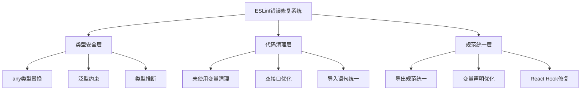
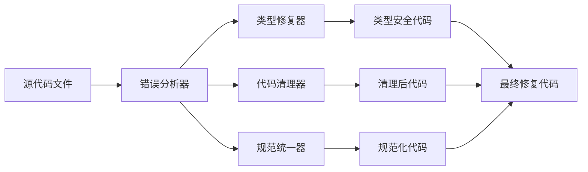

# 设计文档 - ESLint错误修复

## 架构概览

### 整体架构图



## 核心组件

### 1. 类型安全修复组件

**职责：**

- 识别和替换any类型
- 提供类型推断和泛型约束
- 确保类型安全性

**接口：**

```typescript
interface TypeFixer {
  replaceAnyType(code: string): string;
  inferType(context: TypeContext): TypeDefinition;
  addGenericConstraints(type: GenericType): ConstrainedType;
}
```

**依赖：**

- TypeScript编译器
- 上下文分析器

### 2. 代码清理组件

**职责：**

- 移除未使用的变量和导入
- 优化空接口定义
- 统一导入语法

**接口：**

```typescript
interface CodeCleaner {
  removeUnusedVars(code: string): string;
  optimizeInterfaces(interfaces: Interface[]): Interface[];
  normalizeImports(imports: Import[]): Import[];
}
```

**依赖：**

- AST解析器
- 使用情况分析器

### 3. 规范统一组件

**职责：**

- 统一导出规范
- 优化变量声明
- 修复React Hook依赖

**接口：**

```typescript
interface Standardizer {
  normalizeExports(exports: Export[]): Export[];
  optimizeVariableDeclarations(vars: Variable[]): Variable[];
  fixReactHookDeps(hooks: ReactHook[]): ReactHook[];
}
```

**依赖：**

- ESLint规则引擎
- React Hook分析器

## 数据流向图



## 异常处理策略

### 1. 类型推断失败

- **场景：** 无法推断具体类型
- **策略：** 使用unknown类型或泛型约束
- **回退：** 添加类型注释和TODO标记

### 2. 代码清理冲突

- **场景：** 清理可能影响功能
- **策略：** 保守清理，保留可疑代码
- **回退：** 添加注释说明原因

### 3. 规范统一冲突

- **场景：** 不同规范要求冲突
- **策略：** 优先选择更严格的规范
- **回退：** 使用ESLint disable注释

## 修复优先级

### P0 - 关键错误

1. `@typescript-eslint/no-explicit-any` - 类型安全
2. `@typescript-eslint/no-unused-vars` - 代码清洁
3. `@typescript-eslint/no-require-imports` - 规范统一

### P1 - 重要错误

1. `@typescript-eslint/no-empty-object-type` - 接口优化
2. `import/no-anonymous-default-export` - 导出规范
3. `prefer-const` - 变量声明优化

### P2 - 一般错误

1. `react-hooks/exhaustive-deps` - React优化
2. `@next/next/no-img-element` - Next.js优化
3. `prefer-rest-params` - 参数优化
