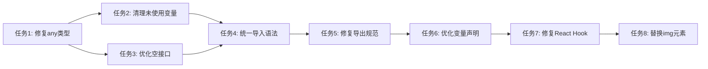

# 任务拆分文档 - ESLint错误修复

## 任务列表

### 任务1：修复any类型错误

#### 输入契约

- 前置依赖：无
- 输入数据：包含any类型的TypeScript文件
- 环境依赖：TypeScript编译器

#### 输出契约

- 输出数据：替换any为具体类型的代码
- 交付物：修复后的TypeScript文件
- 验收标准：所有any类型错误消除

#### 实现约束

- 技术栈：TypeScript, ESLint
- 接口规范：保持现有API不变
- 质量要求：类型安全性提升

### 任务2：清理未使用变量

#### 输入契约

- 前置依赖：任务1完成
- 输入数据：包含未使用变量的文件
- 环境依赖：ESLint分析器

#### 输出契约

- 输出数据：移除未使用变量的代码
- 交付物：清理后的代码文件
- 验收标准：无未使用变量警告

#### 实现约束

- 技术栈：ESLint, AST分析
- 接口规范：保持功能完整性
- 质量要求：代码清洁度提升

### 任务3：优化空接口定义

#### 输入契约

- 前置依赖：任务1完成
- 输入数据：包含空接口的文件
- 环境依赖：TypeScript类型检查

#### 输出契约

- 输出数据：优化后的接口定义
- 交付物：简化的类型定义
- 验收标准：无空接口类型错误

#### 实现约束

- 技术栈：TypeScript
- 接口规范：保持类型兼容性
- 质量要求：类型定义简洁

### 任务4：统一导入语法

#### 输入契约

- 前置依赖：任务2完成
- 输入数据：包含require导入的文件
- 环境依赖：ESLint规则

#### 输出契约

- 输出数据：ES6 import语法
- 交付物：统一导入的代码
- 验收标准：无require导入错误

#### 实现约束

- 技术栈：ESLint, Babel
- 接口规范：保持模块兼容性
- 质量要求：导入语法统一

### 任务5：修复导出规范

#### 输入契约

- 前置依赖：任务4完成
- 输入数据：包含匿名默认导出的文件
- 环境依赖：ESLint规则

#### 输出契约

- 输出数据：命名导出语法
- 交付物：规范化的导出代码
- 验收标准：无匿名导出错误

#### 实现约束

- 技术栈：ESLint
- 接口规范：保持导出兼容性
- 质量要求：导出规范统一

### 任务6：优化变量声明

#### 输入契约

- 前置依赖：任务5完成
- 输入数据：包含let但未重新赋值的变量
- 环境依赖：ESLint规则

#### 输出契约

- 输出数据：const声明的变量
- 交付物：优化的变量声明
- 验收标准：无prefer-const错误

#### 实现约束

- 技术栈：ESLint
- 接口规范：保持变量作用域
- 质量要求：变量声明优化

### 任务7：修复React Hook依赖

#### 输入契约

- 前置依赖：任务6完成
- 输入数据：包含Hook依赖问题的React组件
- 环境依赖：React Hook规则

#### 输出契约

- 输出数据：修复依赖的Hook
- 交付物：优化的React组件
- 验收标准：无Hook依赖警告

#### 实现约束

- 技术栈：React, ESLint
- 接口规范：保持组件功能
- 质量要求：Hook使用规范

### 任务8：替换img为Next.js Image

#### 输入契约

- 前置依赖：任务7完成
- 输入数据：包含img元素的组件
- 环境依赖：Next.js Image组件

#### 输出契约

- 输出数据：使用Next.js Image的组件
- 交付物：优化的图片组件
- 验收标准：无img元素警告

#### 实现约束

- 技术栈：Next.js, React
- 接口规范：保持图片显示功能
- 质量要求：图片优化性能

## 依赖关系图

## 并行任务

- 任务2和任务3可以并行执行（都依赖任务1）
- 任务4和任务5可以并行执行（都依赖任务2和3）

## 复杂度评估

- **任务1**: 高复杂度 - 需要类型推断和上下文分析
- **任务2**: 中复杂度 - 需要AST分析和使用情况检查
- **任务3**: 低复杂度 - 简单的接口优化
- **任务4**: 中复杂度 - 需要模块兼容性检查
- **任务5**: 低复杂度 - 简单的语法转换
- **任务6**: 低复杂度 - 简单的变量声明优化
- **任务7**: 中复杂度 - 需要React Hook规则理解
- **任务8**: 低复杂度 - 简单的组件替换
