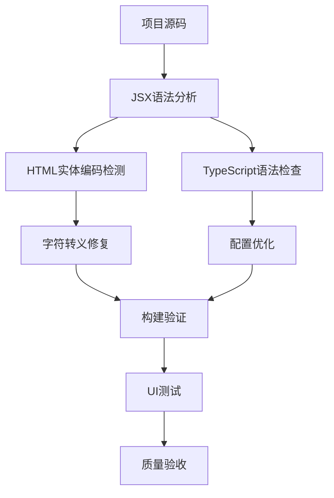
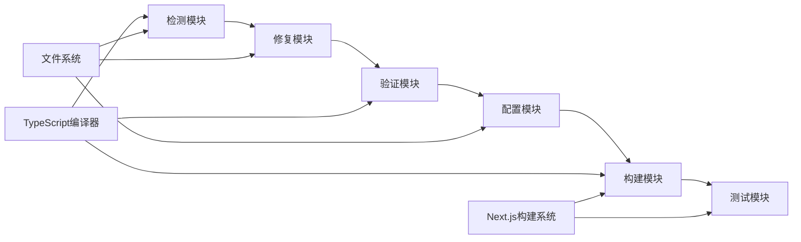
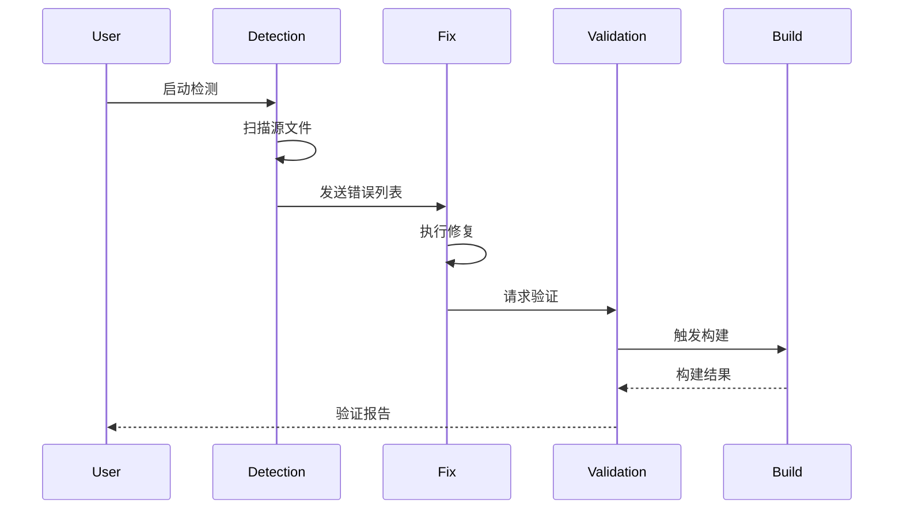

# 设计文档 - JSX转义字符问题修复

## 架构概览

### 整体架构图



## 核心组件

### 1. 语法错误检测模块

**职责**：
- 检测JSX中的HTML实体编码问题
- 识别TypeScript语法冲突
- 发现潜在的构建错误

**接口**：
- 输入：组件源文件路径
- 输出：错误位置和类型列表

**依赖**：
- TypeScript编译器API
- 正则表达式模式匹配

### 2. 字符转义修复模块

**职责**：
- 将HTML实体编码转换为JSX表达式
- 保持代码格式一致性
- 验证修复效果

**接口**：
- 输入：错误文件和位置信息
- 输出：修复后的代码

**依赖**：
- 文件读写操作
- AST解析（如需要）

### 3. 配置优化模块

**职责**：
- 优化TypeScript配置
- 增强库文件跳过机制
- 确保构建系统兼容性

**接口**：
- 输入：当前tsconfig.json
- 输出：优化后的配置

## 接口设计

### 修复流程API

```typescript
interface FixResult {
  success: boolean;
  fixedFiles: string[];
  errors: Array<{
    file: string;
    line: number;
    message: string;
  }>;
}

interface ValidationResult {
  buildSuccess: boolean;
  typeCheckSuccess: boolean;
  lintSuccess: boolean;
  uiTestSuccess: boolean;
}
```

### 配置接口

```typescript
interface TSConfigOptimization {
  skipLibCheck: boolean;
  forceConsistentCasingInFileNames: boolean;
  typeRoots: string[];
  types: string[];
}
```

## 数据模型

### 错误类型枚举

```typescript
enum JSXErrorType {
  HTML_ENTITY = 'html_entity',
  SYNTAX_ERROR = 'syntax_error',
  TYPE_ERROR = 'type_error',
  BUILD_ERROR = 'build_error'
}
```

### 修复记录模型

```typescript
interface FixRecord {
  file: string;
  originalContent: string;
  fixedContent: string;
  errorType: JSXErrorType;
  timestamp: Date;
  validated: boolean;
}
```

## 模块依赖关系图



## 数据流向图



## 异常处理策略

### 1. 语法错误处理
- **检测阶段**：记录所有错误位置，不中断流程
- **修复阶段**：逐个处理，失败时保留原始内容
- **验证阶段**：部分失败时提供详细反馈

### 2. 构建失败处理
- **预检**：修复前进行语法预检
- **回滚**：构建失败时自动恢复备份
- **增量**：支持部分修复和增量验证

### 3. 配置冲突处理
- **备份**：修改前备份原始配置
- **验证**：配置修改后立即验证
- **兼容**：确保与现有工具链兼容

## 性能考虑

### 1. 批量处理
- 一次性处理所有检测到的问题
- 避免重复的文件读写操作
- 优化正则表达式匹配性能

### 2. 增量更新
- 只处理变更的文件
- 缓存检测结果
- 支持部分构建验证

### 3. 并行处理
- 独立文件并行修复
- 异步验证操作
- 非阻塞UI更新

## 质量保证

### 1. 修复质量
- 语法正确性验证
- 语义一致性检查
- 代码风格保持

### 2. 系统稳定性
- 原子化操作
- 事务性修复
- 完整性校验

### 3. 用户体验
- 清晰的进度反馈
- 详细的错误信息
- 可回滚的操作
