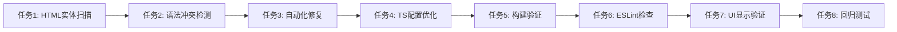

# 任务拆分文档 - JSX转义字符问题修复

## 任务列表

### 任务1：全项目HTML实体编码扫描
#### 输入契约
- 前置依赖：无
- 输入数据：项目根目录路径
- 环境依赖：grep命令、正则表达式支持

#### 输出契约
- 输出数据：所有包含HTML实体编码的文件列表
- 交付物：扫描报告（包含文件路径、行号、具体内容）
- 验收标准：扫描覆盖所有.tsx和.jsx文件，无遗漏

#### 实现约束
- 技术栈：grep/ripgrep + 正则表达式
- 接口规范：输出标准化的错误报告格式
- 质量要求：100%覆盖率，零误报

### 任务2：JSX语法冲突检测
#### 输入契约
- 前置依赖：任务1完成
- 输入数据：HTML实体编码文件列表
- 环境依赖：TypeScript编译器

#### 输出契约
- 输出数据：具体的语法错误类型和位置
- 交付物：TypeScript错误报告
- 验收标准：准确识别所有语法冲突

#### 实现约束
- 技术栈：TypeScript编译器API
- 接口规范：标准TypeScript错误格式
- 质量要求：错误定位精确到行和列

### 任务3：自动化修复执行
#### 输入契约
- 前置依赖：任务2完成
- 输入数据：语法错误详细报告
- 环境依赖：文件读写权限

#### 输出契约
- 输出数据：修复后的文件内容
- 交付物：修复前后对比报告
- 验收标准：所有HTML实体编码正确转换为JSX表达式

#### 实现约束
- 技术栈：Node.js文件操作 + 字符串替换
- 接口规范：保持原有代码格式
- 质量要求：修复准确性100%，不破坏现有功能

### 任务4：TypeScript配置优化
#### 输入契约
- 前置依赖：任务3完成
- 输入数据：当前tsconfig.json
- 环境依赖：TypeScript版本兼容性

#### 输出契约
- 输出数据：优化后的TypeScript配置
- 交付物：配置变更说明文档
- 验收标准：库文件错误完全跳过，项目代码检查正常

#### 实现约束
- 技术栈：JSON配置文件操作
- 接口规范：保持Next.js兼容性
- 质量要求：配置向后兼容，不影响现有构建流程

### 任务5：构建验证测试
#### 输入契约
- 前置依赖：任务4完成
- 输入数据：修复后的项目代码
- 环境依赖：Node.js运行环境、npm包管理器

#### 输出契约
- 输出数据：构建成功/失败状态
- 交付物：构建日志和错误报告
- 验收标准：构建成功，无语法错误，无类型错误

#### 实现约束
- 技术栈：npm scripts + Next.js构建系统
- 接口规范：标准构建流程
- 质量要求：构建时间合理，输出清晰

### 任务6：ESLint代码规范检查
#### 输入契约
- 前置依赖：任务5完成
- 输入数据：修复后的代码
- 环境依赖：ESLint配置

#### 输出契约
- 输出数据：代码规范检查结果
- 交付物：ESLint报告
- 验收标准：无规范违反，代码风格一致

#### 实现约束
- 技术栈：ESLint + 项目配置
- 接口规范：现有ESLint规则
- 质量要求：零规范违反

### 任务7：UI显示验证
#### 输入契约
- 前置依赖：任务6完成
- 输入数据：构建成功的应用
- 环境依赖：浏览器环境、开发服务器

#### 输出契约
- 输出数据：UI显示状态报告
- 交付物：页面截图和功能测试报告
- 验收标准：所有修复的文本正确显示，UI布局无异常

#### 实现约束
- 技术栈：浏览器 + 开发服务器
- 接口规范：用户界面标准
- 质量要求：视觉效果无变化，功能完全正常

### 任务8：回归测试执行
#### 输入契约
- 前置依赖：任务7完成
- 输入数据：完整的应用
- 环境依赖：测试框架（Jest/Playwright）

#### 输出契约
- 输出数据：测试执行结果
- 交付物：测试覆盖率报告
- 验收标准：所有现有测试通过，覆盖率不降低

#### 实现约束
- 技术栈：Jest + React Testing Library/Playwright
- 接口规范：现有测试规范
- 质量要求：测试通过率100%

## 依赖关系图

## 任务优先级

### P0（关键路径）
- 任务3: 自动化修复执行
- 任务4: TypeScript配置优化
- 任务5: 构建验证测试

### P1（重要）
- 任务1: 全项目HTML实体编码扫描
- 任务2: JSX语法冲突检测
- 任务7: UI显示验证

### P2（补充验证）
- 任务6: ESLint代码规范检查
- 任务8: 回归测试执行

## 风险评估

### 高风险任务
- **任务5**: 构建可能因其他未发现问题失败
- **任务7**: UI可能出现意外的显示问题

### 缓解措施
- 每个任务完成后立即验证
- 保留修复前的备份
- 采用增量修复策略

## 时间估算

- 任务1-2: 30分钟（检测和分析）
- 任务3-4: 45分钟（修复和配置）
- 任务5-6: 30分钟（构建和检查）
- 任务7-8: 30分钟（UI验证和测试）

**总计**：约2小时

## 交付标准

每个任务完成时必须：
1. 生成相应的报告文档
2. 通过验收标准检查
3. 更新整体进度状态
4. 准备下一任务的输入数据
