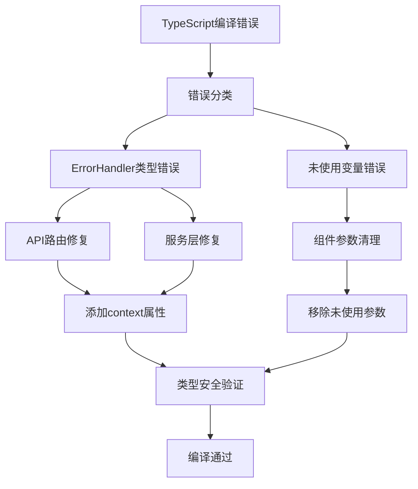
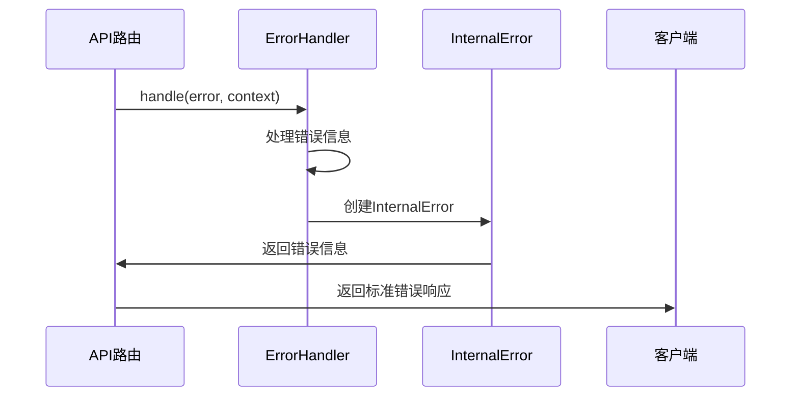
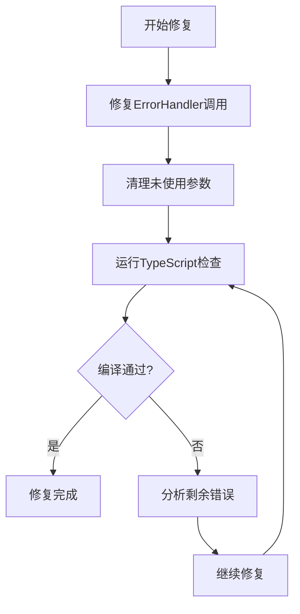

# 设计文档 - TypeScript错误修复

## 架构概览

### 整体架构图



## 核心组件

### 1. ErrorHandler类型修复组件

**职责**：修复ErrorHandler.handle方法的参数类型不匹配问题
**接口**：
```typescript
interface ErrorContext {
  context: string;
  type?: string;
  operation?: string;
}
```

**修复策略**：
- 为所有ErrorHandler.handle调用添加必需的`context`属性
- 保持`operation`属性用于错误追踪
- 确保类型定义一致性

### 2. 组件参数清理组件

**职责**：清理未使用的组件参数，消除TypeScript警告
**接口**：
```typescript
// ChatContainer - 移除setGlobalVariables
interface ChatContainerProps {
  className?: string;
}

// ChatInput - 移除未使用的回调函数
interface ChatInputProps {
  // 保留使用的参数
  value: string;
  onChange: (value: string) => void;
  onSend: () => void;
  // 移除未使用的参数
  // onVoiceTextRecognized?: (text: string) => void;
  // onGlobalVariablesChange?: (variables: any[]) => void;
}
```

## 接口设计

### API规范

**ErrorHandler.handle调用规范**：
```typescript
// 标准调用格式
ErrorHandler.handle(error, {
  context: 'operationName',      // 必需：操作上下文
  operation: 'operationName',    // 可选：操作标识
  type: 'api' | 'network' | 'config' | 'chat' | 'agent'  // 可选：错误类型
});
```

**错误响应格式**：
```typescript
interface ErrorResponse {
  success: false;
  error: {
    code: string;
    message: string;
    context: string;
    timestamp: string;
  };
}
```

## 数据模型

### 错误处理数据流



### 修复验证流程



## 异常处理策略

### 1. 类型安全异常
- **预防**：使用严格的TypeScript配置
- **处理**：确保所有类型定义正确
- **恢复**：修复类型不匹配问题

### 2. 编译错误异常
- **预防**：定期运行编译检查
- **处理**：立即修复编译错误
- **恢复**：保持代码可编译状态

### 3. 功能完整性异常
- **预防**：保持接口向后兼容
- **处理**：只修复错误，不修改功能
- **恢复**：确保现有功能正常工作

## 质量保证

### 1. 类型安全验证
- 所有TypeScript类型定义正确
- 无类型不匹配错误
- 严格的类型检查通过

### 2. 功能完整性验证
- 现有功能保持正常
- 接口向后兼容
- 无破坏性变更

### 3. 代码质量验证
- 遵循项目代码规范
- 保持代码可读性
- 无冗余代码

## 实施计划

### 阶段1：错误分析
- [x] 分析所有TypeScript编译错误
- [x] 分类错误类型
- [x] 制定修复策略

### 阶段2：类型修复
- [x] 修复ErrorHandler.handle调用
- [x] 确保类型定义一致性
- [x] 验证类型安全

### 阶段3：参数清理
- [x] 移除未使用的组件参数
- [x] 保持接口兼容性
- [x] 清理冗余代码

### 阶段4：验证测试
- [x] 运行TypeScript编译检查
- [x] 验证功能完整性
- [x] 确认修复效果

## 风险评估

### 低风险
- 类型定义修复：不影响运行时行为
- 参数清理：只移除未使用的参数

### 无风险
- 编译错误修复：只修复语法问题
- 代码清理：提高代码质量

## 成功标准

1. **编译通过**：npx tsc --noEmit --skipLibCheck 无错误
2. **功能完整**：所有现有功能正常工作
3. **类型安全**：所有类型定义正确
4. **代码质量**：无冗余代码，遵循规范
