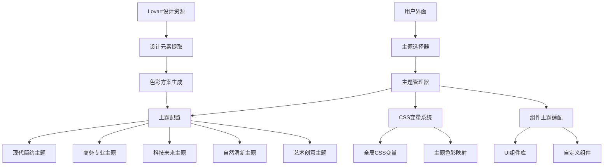
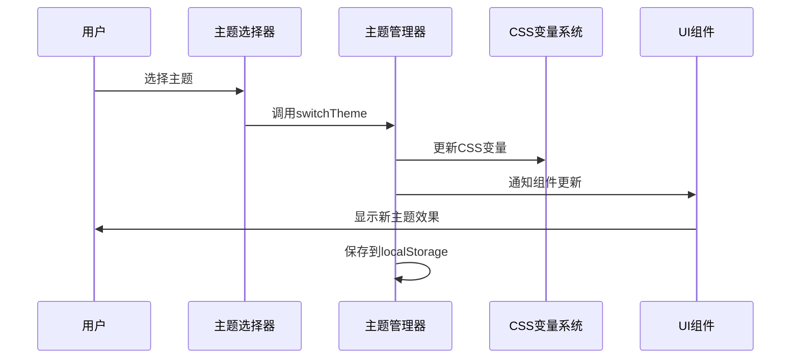

# 设计文档 - UI主题美化

## 架构概览

### 整体架构图



## 核心组件

### 1. 主题管理器 (ThemeManager)

**职责：**

- 管理主题状态和切换逻辑
- 提供主题配置接口
- 处理主题持久化存储

**接口：**

```typescript
interface ThemeManager {
  currentTheme: string;
  availableThemes: ThemeConfig[];
  switchTheme(themeId: string): void;
  getThemeConfig(themeId: string): ThemeConfig;
  saveThemePreference(themeId: string): void;
}
```

**依赖：**

- next-themes
- localStorage
- 主题配置数据

### 2. 主题选择器 (ThemeSelector)

**职责：**

- 提供主题选择界面
- 显示主题预览
- 处理用户交互

**接口：**

```typescript
interface ThemeSelectorProps {
  themes: ThemeConfig[];
  currentTheme: string;
  onThemeChange: (themeId: string) => void;
}
```

**依赖：**

- 主题管理器
- UI组件库

### 3. 主题配置系统 (ThemeConfig)

**职责：**

- 定义主题数据结构
- 管理主题配置数据
- 提供主题验证

**接口：**

```typescript
interface ThemeConfig {
  id: string;
  name: string;
  description: string;
  category: 'modern' | 'business' | 'tech' | 'nature' | 'art';
  colors: ColorScheme;
  styles: StyleScheme;
  preview: string;
}

interface ColorScheme {
  primary: string;
  secondary: string;
  accent: string;
  background: string;
  surface: string;
  text: string;
  textSecondary: string;
  border: string;
  success: string;
  warning: string;
  error: string;
}

interface StyleScheme {
  borderRadius: string;
  shadows: string[];
  animations: string[];
  typography: TypographyConfig;
}
```

## 接口设计

### API规范

**主题切换端点：**

- 端点：`/api/theme/switch`
- 请求格式：`{ themeId: string }`
- 响应格式：`{ success: boolean, currentTheme: string }`
- 错误处理：统一错误响应格式

**主题配置端点：**

- 端点：`/api/theme/config`
- 请求格式：无参数
- 响应格式：`{ themes: ThemeConfig[] }`
- 错误处理：返回默认主题配置

### 数据流向图



## 数据模型

### 实体设计

**主题实体 (Theme)**

- id: 主题唯一标识
- name: 主题显示名称
- description: 主题描述
- category: 主题分类
- colors: 色彩配置
- styles: 样式配置
- preview: 预览图片

**色彩配置实体 (ColorScheme)**

- primary: 主色调
- secondary: 辅助色
- accent: 强调色
- background: 背景色
- surface: 表面色
- text: 文字色
- textSecondary: 次要文字色
- border: 边框色
- success: 成功色
- warning: 警告色
- error: 错误色

### 关系映射

- 主题 1:1 色彩配置
- 主题 1:1 样式配置
- 主题 1:1 预览图片

### 约束条件

- 主题ID必须唯一
- 色彩值必须为有效十六进制颜色
- 主题名称不能为空
- 预览图片必须存在

## 异常处理策略

### 主题切换异常

- 主题不存在：回退到默认主题
- 配置加载失败：使用内置默认配置
- 存储失败：仅内存切换，不持久化

### 组件渲染异常

- 主题变量未定义：使用fallback值
- 组件适配失败：显示默认样式
- 预览加载失败：显示占位符

### 性能优化策略

- 主题配置懒加载
- CSS变量批量更新
- 组件渲染防抖
- 预览图片预加载

## 实现计划

### 阶段1：基础架构

1. 创建主题管理器
2. 定义主题配置结构
3. 实现CSS变量系统

### 阶段2：主题开发

1. 分析Lovart设计资源
2. 创建5个主题配置
3. 实现主题切换逻辑

### 阶段3：组件适配

1. 适配现有UI组件
2. 创建主题选择器
3. 实现主题预览

### 阶段4：测试优化

1. 单元测试覆盖
2. 性能优化
3. 用户体验优化
