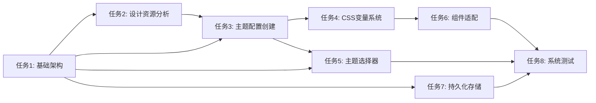

# 任务拆分文档 - UI主题美化

## 任务列表

### 任务1：主题系统基础架构

#### 输入契约

- 前置依赖：现有next-themes系统
- 输入数据：Lovart设计资源分析结果
- 环境依赖：TypeScript、Tailwind CSS、Next.js

#### 输出契约

- 输出数据：主题管理器组件、主题配置类型定义
- 交付物：
  - `lib/theme/theme-manager.ts` - 主题管理器
  - `types/theme.ts` - 主题类型定义
  - `lib/theme/theme-config.ts` - 主题配置数据
- 验收标准：
  - 主题管理器功能完整
  - 类型定义准确
  - 配置数据结构清晰

#### 实现约束

- 技术栈：TypeScript + React
- 接口规范：遵循现有API设计模式
- 质量要求：单元测试覆盖率 > 80%

### 任务2：Lovart设计资源分析

#### 输入契约

- 前置依赖：Lovart目录访问权限
- 输入数据：430+PNG设计文件
- 环境依赖：图像分析工具

#### 输出契约

- 输出数据：设计元素提取结果、色彩方案
- 交付物：
  - `docs/UI主题美化/design-analysis.md` - 设计分析报告
  - `lib/theme/color-palettes.ts` - 提取的色彩方案
  - `public/theme-previews/` - 主题预览图片
- 验收标准：
  - 至少提取5个主题色彩方案
  - 设计分析报告完整
  - 预览图片质量良好

#### 实现约束

- 技术栈：图像处理工具
- 接口规范：标准色彩格式
- 质量要求：色彩方案符合设计原则

### 任务3：主题配置创建

#### 输入契约

- 前置依赖：任务1、任务2完成
- 输入数据：主题类型定义、色彩方案
- 环境依赖：主题管理器

#### 输出契约

- 输出数据：5个完整主题配置
- 交付物：
  - `lib/theme/themes/modern.ts` - 现代简约主题
  - `lib/theme/themes/business.ts` - 商务专业主题
  - `lib/theme/themes/tech.ts` - 科技未来主题
  - `lib/theme/themes/nature.ts` - 自然清新主题
  - `lib/theme/themes/art.ts` - 艺术创意主题
- 验收标准：
  - 每个主题配置完整
  - 色彩搭配协调
  - 明暗模式适配

#### 实现约束

- 技术栈：TypeScript
- 接口规范：遵循ThemeConfig接口
- 质量要求：主题配置验证通过

### 任务4：CSS变量系统扩展

#### 输入契约

- 前置依赖：任务3完成
- 输入数据：主题配置数据
- 环境依赖：现有CSS变量系统

#### 输出契约

- 输出数据：动态CSS变量系统
- 交付物：
  - `styles/theme-variables.css` - 主题变量定义
  - `lib/theme/css-generator.ts` - CSS变量生成器
  - 更新的`app/globals.css` - 全局样式更新
- 验收标准：
  - CSS变量动态更新
  - 主题切换无闪烁
  - 性能优化到位

#### 实现约束

- 技术栈：CSS + TypeScript
- 接口规范：CSS变量命名规范
- 质量要求：跨浏览器兼容

### 任务5：主题选择器组件

#### 输入契约

- 前置依赖：任务1、任务3完成
- 输入数据：主题配置数据、主题管理器
- 环境依赖：UI组件库

#### 输出契约

- 输出数据：主题选择器组件
- 交付物：
  - `components/theme/theme-selector.tsx` - 主题选择器
  - `components/theme/theme-preview.tsx` - 主题预览
  - `components/theme/theme-card.tsx` - 主题卡片
- 验收标准：
  - 组件功能完整
  - 用户交互流畅
  - 响应式设计

#### 实现约束

- 技术栈：React + TypeScript
- 接口规范：遵循现有组件设计
- 质量要求：无障碍访问支持

### 任务6：现有组件主题适配

#### 输入契约

- 前置依赖：任务4完成
- 输入数据：现有UI组件、主题变量
- 环境依赖：组件库

#### 输出契约

- 输出数据：适配后的UI组件
- 交付物：
  - 更新的`components/ui/` 组件
  - 更新的`components/` 自定义组件
  - `lib/theme/component-adapter.ts` - 组件适配器
- 验收标准：
  - 所有组件支持主题切换
  - 视觉效果一致
  - 性能无影响

#### 实现约束

- 技术栈：React + CSS
- 接口规范：保持现有组件接口
- 质量要求：向后兼容

### 任务7：主题持久化存储

#### 输入契约

- 前置依赖：任务1完成
- 输入数据：主题选择状态
- 环境依赖：localStorage API

#### 输出契约

- 输出数据：主题存储系统
- 交付物：
  - `lib/theme/theme-storage.ts` - 主题存储管理
  - `hooks/use-theme-storage.ts` - 主题存储Hook
- 验收标准：
  - 主题选择持久化
  - 跨会话保持
  - 错误处理完善

#### 实现约束

- 技术栈：TypeScript + localStorage
- 接口规范：异步存储接口
- 质量要求：存储可靠性

### 任务8：主题系统测试

#### 输入契约

- 前置依赖：所有任务完成
- 输入数据：完整主题系统
- 环境依赖：测试框架

#### 输出契约

- 输出数据：测试报告
- 交付物：
  - `tests/theme/` - 主题系统测试
  - `tests/components/theme/` - 组件测试
  - 测试覆盖率报告
- 验收标准：
  - 单元测试覆盖率 > 80%
  - 集成测试通过
  - 性能测试达标

#### 实现约束

- 技术栈：Jest + Testing Library
- 接口规范：测试标准
- 质量要求：全面测试覆盖

## 依赖关系图

## 任务优先级

1. **P0 (必须)**: 任务1、任务2、任务3 - 核心架构和配置
2. **P1 (重要)**: 任务4、任务5 - 用户界面和交互
3. **P2 (一般)**: 任务6、任务7 - 功能完善
4. **P3 (可选)**: 任务8 - 质量保证

## 风险评估

### 高风险

- Lovart设计资源分析复杂度
- 现有组件适配工作量

### 中风险

- 主题切换性能优化
- 跨浏览器兼容性

### 低风险

- 类型定义和接口设计
- 基础功能实现
