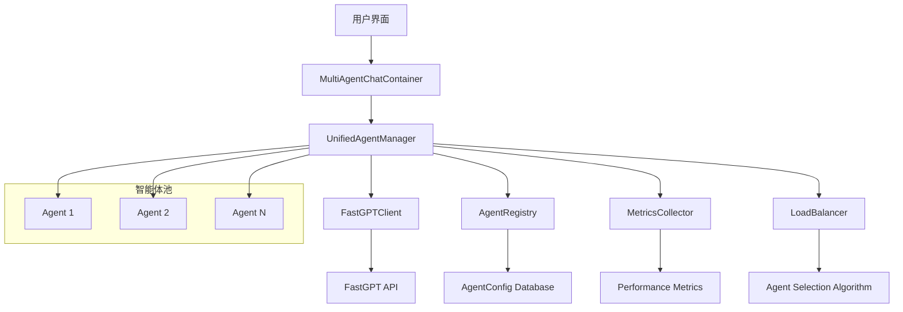

# 多智能体架构设计文档

## 概述

本文档详细描述了AI聊天接口系统的多智能体架构设计，包括统一智能体管理器、负载均衡机制、错误处理策略等核心组件。

## 架构图



## 核心组件

### 1. UnifiedAgentManager

统一智能体管理器是整个多智能体系统的核心，负责：

- **智能体生命周期管理**：注册、更新、删除智能体
- **请求路由**：将用户请求路由到合适的智能体
- **负载均衡**：根据智能体状态和负载选择最佳智能体
- **错误处理**：处理智能体故障和重试逻辑
- **指标收集**：收集和监控智能体性能数据

#### 主要方法

```typescript
class UnifiedAgentManager {
  // 智能体管理
  async registerAgent(agent: UnifiedAgent): Promise<void>
  unregisterAgent(agentId: string): void
  getAllAgents(): UnifiedAgent[]

  // 聊天功能
  async chat(agent: UnifiedAgent, messages: Message[]): Promise<FastGPTChatResponse>
  async streamChat(agent: UnifiedAgent, messages: Message[], options: StreamOptions): Promise<void>

  // 负载均衡
  selectBestAgent(): UnifiedAgent | null

  // 指标管理
  getAgentMetrics(agentId: string): AgentMetrics | undefined
  resetAgentMetrics(agentId: string): void
}
```

### 2. AgentConfig

智能体配置接口定义了每个智能体的完整配置信息：

```typescript
interface AgentConfig {
  // 基础信息
  id: string
  name: string
  description: string
  type: AgentType

  // API配置
  apiKey: string
  appId: string
  apiUrl: string

  // 模型配置
  systemPrompt: string
  temperature: number
  maxTokens: number

  // 功能支持
  supportsStream: boolean
  supportsFileUpload: boolean
  supportsImageUpload: boolean

  // 负载均衡设置
  settings: AgentSettings
}

interface AgentSettings {
  loadBalanceWeight: number
  retryCount: number
  timeout: number
  cacheEnabled: boolean
  logLevel: 'debug' | 'info' | 'warn' | 'error'
}
```

### 3. AgentMetrics

智能体指标接口用于监控智能体性能：

```typescript
interface AgentMetrics {
  requestCount: number
  successfulRequests: number
  failedRequests: number
  averageResponseTime: number
  lastRequestTime: Date | null
  lastError: string | null
}
```

## 负载均衡策略

### 1. 权重轮询 (Weighted Round Robin)

根据智能体的 `loadBalanceWeight` 进行轮询选择：

```typescript
private selectAgentByWeight(): UnifiedAgent | null {
  const activeAgents = this.getActiveAgents();
  if (activeAgents.length === 0) return null;

  const totalWeight = activeAgents.reduce(
    (sum, agent) => sum + (agent.config.settings.loadBalanceWeight || 1), 0
  );

  let random = Math.random() * totalWeight;

  for (const agent of activeAgents) {
    random -= (agent.config.settings.loadBalanceWeight || 1);
    if (random <= 0) return agent;
  }

  return activeAgents[0];
}
```

### 2. 最少连接 (Least Connections)

选择当前连接数最少的智能体：

```typescript
private selectAgentByConnections(): UnifiedAgent | null {
  const activeAgents = this.getActiveAgents();
  if (activeAgents.length === 0) return null;

  return activeAgents.reduce((least, current) => {
    const leastConnections = this.getAgentConnections(least.id);
    const currentConnections = this.getAgentConnections(current.id);
    return currentConnections < leastConnections ? current : least;
  });
}
```

### 3. 响应时间优先 (Response Time Priority)

选择平均响应时间最短的智能体：

```typescript
private selectAgentByResponseTime(): UnifiedAgent | null {
  const activeAgents = this.getActiveAgents();
  if (activeAgents.length === 0) return null;

  return activeAgents.reduce((fastest, current) => {
    const fastestTime = this.getAgentMetrics(fastest.id)?.averageResponseTime || Infinity;
    const currentTime = this.getAgentMetrics(current.id)?.averageResponseTime || Infinity;
    return currentTime < fastestTime ? current : fastest;
  });
}
```

## 错误处理机制

### 1. 重试策略

```typescript
private async executeWithRetry<T>(
  operation: () => Promise<T>,
  agent: UnifiedAgent,
  maxRetries: number = 3
): Promise<T> {
  let lastError: Error;

  for (let attempt = 1; attempt <= maxRetries; attempt++) {
    try {
      return await operation();
    } catch (error) {
      lastError = error as Error;

      if (attempt < maxRetries) {
        const delay = Math.pow(2, attempt) * 1000; // 指数退避
        await new Promise(resolve => setTimeout(resolve, delay));
      }
    }
  }

  this.handleAgentError(agent.id, lastError!);
  throw lastError!;
}
```

### 2. 熔断器模式

```typescript
private isCircuitOpen(agentId: string): boolean {
  const metrics = this.getAgentMetrics(agentId);
  if (!metrics) return false;

  const failureRate = metrics.failedRequests / metrics.requestCount;
  return failureRate > this.circuitBreakerThreshold;
}
```

### 3. 健康检查

```typescript
private async performHealthCheck(agent: UnifiedAgent): Promise<boolean> {
  try {
    const testMessage = [{ role: 'user', content: 'ping' }];
    await this.chat(agent, testMessage);
    return true;
  } catch (error) {
    return false;
  }
}
```

## 性能监控

### 1. 指标收集

```typescript
private updateAgentMetrics(agentId: string, responseTime: number, success: boolean): void {
  const metrics = this.getAgentMetrics(agentId);
  if (!metrics) return;

  metrics.requestCount++;
  if (success) {
    metrics.successfulRequests++;
    metrics.averageResponseTime = this.calculateAverageResponseTime(metrics, responseTime);
  } else {
    metrics.failedRequests++;
  }

  metrics.lastRequestTime = new Date();
}
```

### 2. 性能报告

```typescript
interface PerformanceReport {
  totalRequests: number
  successRate: number
  averageResponseTime: number
  topPerformingAgent: string
  agentMetrics: AgentMetrics[]
}
```

## 配置管理

### 1. 环境变量

```env
# FastGPT配置
FASTGPT_API_URL=https://your-fastgpt.run
FASTGPT_API_KEY=your-api-key

# 负载均衡配置
LOAD_BALANCE_STRATEGY=weighted_round_robin
CIRCUIT_BREAKER_THRESHOLD=0.5
HEALTH_CHECK_INTERVAL=30000
```

### 2. 动态配置

支持运行时动态更新智能体配置：

```typescript
async updateAgentConfig(agentId: string, newConfig: Partial<AgentConfig>): Promise<void> {
  const agent = this.agents.get(agentId);
  if (!agent) throw new Error(`Agent ${agentId} not found`);

  agent.config = { ...agent.config, ...newConfig };
  agent.config.updatedAt = new Date();

  // 重新初始化客户端
  await this.initializeAgentClient(agent);
}
```

## 最佳实践

### 1. 智能体设计

- **单一职责**：每个智能体应该专注于特定的任务领域
- **配置标准化**：使用统一的配置接口和命名规范
- **错误处理**：实现完善的错误处理和恢复机制
- **监控指标**：设置关键性能指标监控

### 2. 负载均衡

- **权重设置**：根据智能体性能合理设置负载权重
- **健康检查**：定期检查智能体健康状态
- **故障转移**：实现快速故障检测和转移机制

### 3. 性能优化

- **连接池**：使用连接池管理API连接
- **缓存策略**：实现智能缓存减少重复请求
- **异步处理**：使用异步处理提高并发性能

## 扩展性

### 1. 新智能体类型

系统设计支持添加新的智能体类型：

```typescript
type AgentType = 'fastgpt' | 'openai' | 'claude' | 'custom';

interface CustomAgentConfig extends AgentConfig {
  customEndpoint: string
  customAuth: CustomAuthConfig
}
```

### 2. 新负载均衡策略

```typescript
interface LoadBalanceStrategy {
  selectAgent(agents: UnifiedAgent[]): UnifiedAgent | null
}

class CustomLoadBalanceStrategy implements LoadBalanceStrategy {
  selectAgent(agents: UnifiedAgent[]): UnifiedAgent | null {
    // 自定义选择逻辑
  }
}
```

### 3. 新监控指标

```typescript
interface ExtendedAgentMetrics extends AgentMetrics {
  customMetric1: number
  customMetric2: string
  customMetric3: CustomData
}
```

## 总结

多智能体架构为AI聊天系统提供了强大的扩展性和可靠性。通过统一的管理接口、智能的负载均衡和完善的错误处理，系统能够高效地处理大量并发请求，同时保持高可用性和良好的用户体验。

关键优势：

1. **高可用性**：多智能体冗余和故障转移
2. **高性能**：智能负载均衡和性能优化
3. **可扩展性**：模块化设计支持快速扩展
4. **可监控性**：完善的指标收集和监控
5. **易维护性**：统一的接口和配置管理
