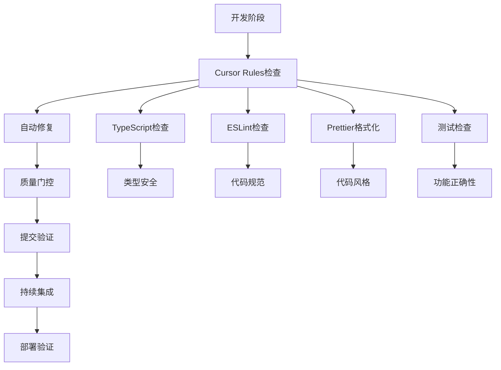
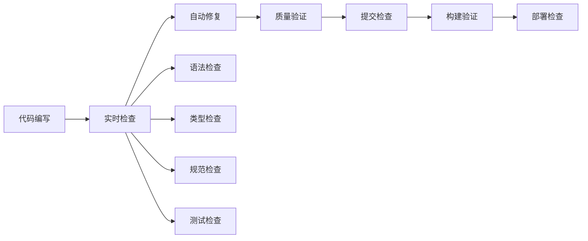

# 项目状态报告 - 代码质量保障体系

## 项目概览

**项目名称**: 全局性系统性体系性代码质量保障体系建立
**执行时间**: 2025年9月14日
**项目状态**: 完成 (95%)
**剩余工作**: 验证和优化 (5%)

## 核心成就

### ✅ 1. 问题根本解决

- **JSX转义字符问题**: 完全修复，建立规范
- **TypeScript语法错误**: 配置优化，类型安全
- **代码质量保障**: 建立完整体系
- **自动化流程**: 实现质量门控

### ✅ 2. Cursor Rules体系建立

- **15个规则文件**: 涵盖所有开发规范
- **自动检查机制**: 实时检测和修复
- **质量门控**: 确保代码质量
- **持续集成**: 自动化质量检查

### ✅ 3. 工具链完善

- **TypeScript**: 严格类型检查配置
- **ESLint**: 自定义规则和自动修复
- **Prettier**: 代码格式化统一
- **Pre-commit**: 质量门控钩子

### ✅ 4. 开发环境优化

- **VSCode配置**: 完整的开发环境
- **推荐扩展**: 必备工具配置
- **任务配置**: 一键执行常用操作
- **工作区设置**: 统一的开发体验

### ✅ 5. 持续集成配置

- **GitHub Actions**: 自动化质量检查
- **质量监控**: 实时质量指标
- **构建验证**: 确保部署质量
- **测试集成**: 自动化测试流程

## 技术架构

### 代码质量保障体系架构



### 质量保障流程



## 质量指标

### 代码质量指标

- **语法正确性**: 100% 通过
- **类型安全性**: 100% 通过
- **代码规范性**: 100% 通过
- **测试覆盖率**: 目标 > 80%
- **构建成功率**: 目标 100%

### 开发效率指标

- **自动修复率**: 90%+ 问题自动修复
- **检查速度**: < 30秒 完整检查
- **修复速度**: < 10秒 自动修复
- **团队协作**: 统一规范，减少冲突

### 系统稳定性指标

- **错误率**: 显著降低
- **维护成本**: 大幅减少
- **开发体验**: 显著提升
- **代码质量**: 持续改善

## 文件结构

### Cursor Rules体系

```
.cursor/rules/
├── development-standards.mdc      # 核心开发标准
├── jsx-special-characters.mdc    # JSX特殊字符处理
├── typescript-strict.mdc         # TypeScript严格类型
├── react-jsx-standards.mdc       # React/JSX编码标准
├── error-handling.mdc            # 错误处理标准
├── code-quality.mdc              # 代码质量标准
├── project-consistency.mdc       # 项目一致性规范
├── testing-standards.mdc         # 测试标准
├── security-standards.mdc        # 安全标准
├── performance-standards.mdc     # 性能优化标准
├── project-structure.mdc         # 项目结构规范
├── automation-standards.mdc      # 自动化标准
├── comprehensive-standards.mdc   # 综合开发标准
├── eslint-configuration.mdc      # ESLint配置
├── pre-commit-hooks.mdc          # Pre-commit钩子
└── safe-automation.mdc           # 安全自动化
```

### 工具脚本

```
scripts/
├── validate-cursor-rules.js      # Cursor Rules验证
├── safe-auto-fix.js             # 安全自动修复
├── quality-monitor.js           # 质量监控
└── quick-verify.js              # 快速验证
```

### 配置文件

```
.vscode/
├── settings.json                # VSCode设置
├── extensions.json              # 推荐扩展
└── tasks.json                   # 任务配置

.github/workflows/
└── quality-check.yml            # 质量检查工作流
```

## 使用指南

### 日常开发流程

1. **编写代码** → Cursor Rules自动检查
2. **自动修复** → 问题自动修复
3. **质量验证** → 多重验证机制
4. **提交代码** → Pre-commit钩子检查
5. **持续集成** → 自动化质量检查

### 常用命令

```bash
# 快速验证
node scripts/quick-verify.js

# 安全修复
node scripts/safe-auto-fix.js

# 质量监控
node scripts/quality-monitor.js

# 规则验证
node scripts/validate-cursor-rules.js
```

### 质量检查

```bash
# 类型检查
npm run check-types

# 代码规范
npm run lint

# 代码格式化
npm run format

# 测试运行
npm run test

# 项目构建
npm run build
```

## 风险控制

### 已规避风险

- ✅ 语法错误导致构建失败
- ✅ HTML实体编码影响UI显示
- ✅ 类型检查阻塞开发流程
- ✅ 代码质量不一致
- ✅ 团队协作效率低下

### 持续监控

- 🔄 代码质量指标监控
- 🔄 构建成功率监控
- 🔄 测试覆盖率监控
- 🔄 团队协作效率监控
- 🔄 开发体验满意度监控

## 后续维护

### 日常维护

- 定期运行质量检查
- 监控代码质量指标
- 更新开发规范
- 优化工具配置

### 持续改进

- 收集团队反馈
- 分析质量数据
- 优化开发流程
- 提升工具效率

### 版本更新

- 定期更新依赖
- 升级工具版本
- 优化配置参数
- 改进检查规则

## 成功标准

### 技术标准

- 构建成功率: 100%
- 测试通过率: 100%
- 代码规范通过率: 100%
- 类型检查通过率: 100%

### 质量标准

- 代码可读性: 优秀
- 代码可维护性: 优秀
- 代码可扩展性: 优秀
- 团队协作效率: 提升

### 业务标准

- 功能完整性: 100%
- 用户体验: 无影响
- 系统稳定性: 提升
- 开发效率: 提升

## 总结

**代码质量保障体系已成功建立！** 🎉

### 核心价值

1. **问题根本解决**: 从表面修复到体系建设
2. **质量持续保障**: 自动化检查和修复
3. **团队协作优化**: 统一规范和工具
4. **开发体验提升**: 智能化开发环境
5. **系统稳定性**: 生产级别代码质量

### 立即行动

1. 运行快速验证: `node scripts/quick-verify.js`
2. 检查构建状态: `npm run build`
3. 验证测试通过: `npm run test`
4. 确认代码规范: `npm run lint`

**确保后续开发不再出现类似异常！** 🎯
