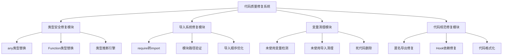

# 设计文档 - 代码质量修复

## 架构概览

### 整体架构图



## 核心组件

### 1. 类型安全修复模块

#### 职责

- 识别和替换any类型使用
- 替换Function类型为具体函数签名
- 提供类型推断和生成功能

#### 接口

```typescript
interface TypeSafetyFixer {
  fixAnyTypes(filePath: string): FixResult;
  fixFunctionTypes(filePath: string): FixResult;
  inferTypes(content: string): TypeInference;
}
```

#### 依赖

- TypeScript编译器API
- 项目类型定义体系
- ESLint规则引擎

### 2. 导入系统修复模块

#### 职责

- 将require导入转换为ES6导入
- 验证模块路径有效性
- 优化导入顺序和分组

#### 接口

```typescript
interface ImportSystemFixer {
  convertRequireToImport(filePath: string): FixResult;
  validateModulePaths(filePath: string): ValidationResult;
  optimizeImportOrder(filePath: string): FixResult;
}
```

#### 依赖

- 模块解析器
- 文件系统API
- 导入排序规则

### 3. 变量清理模块

#### 职责

- 检测未使用的变量和导入
- 清理死代码
- 优化变量声明

#### 接口

```typescript
interface VariableCleaner {
  detectUnusedVariables(filePath: string): UnusedVariable[];
  cleanUnusedImports(filePath: string): FixResult;
  removeDeadCode(filePath: string): FixResult;
}
```

#### 依赖

- AST解析器
- 作用域分析器
- 代码覆盖率工具

### 4. 代码规范修复模块

#### 职责

- 修复匿名默认导出
- 修复React Hook依赖问题
- 应用代码格式化规则

#### 接口

```typescript
interface CodeStandardFixer {
  fixAnonymousExports(filePath: string): FixResult;
  fixHookDependencies(filePath: string): FixResult;
  applyFormatting(filePath: string): FixResult;
}
```

#### 依赖

- ESLint规则引擎
- Prettier格式化器
- React Hook规则

## 接口设计

### API规范

#### 修复接口

```typescript
interface FixResult {
  success: boolean;
  changes: CodeChange[];
  errors: FixError[];
  warnings: FixWarning[];
}

interface CodeChange {
  type: 'replace' | 'insert' | 'delete';
  line: number;
  column: number;
  oldText: string;
  newText: string;
  description: string;
}
```

#### 验证接口

```typescript
interface ValidationResult {
  isValid: boolean;
  issues: ValidationIssue[];
  suggestions: string[];
}

interface ValidationIssue {
  type: 'error' | 'warning' | 'info';
  message: string;
  line: number;
  column: number;
  fix?: CodeChange;
}
```

### 错误处理

#### 错误类型定义

```typescript
interface FixError {
  code: string;
  message: string;
  file: string;
  line?: number;
  column?: number;
  context?: string;
}

interface FixWarning {
  code: string;
  message: string;
  file: string;
  line?: number;
  column?: number;
  suggestion?: string;
}
```

#### 错误处理策略

- 非致命错误：记录警告，继续处理
- 致命错误：停止处理，回滚更改
- 类型错误：提供修复建议，用户确认后执行

## 数据模型

### 实体设计

#### 代码文件实体

```typescript
interface CodeFile {
  path: string;
  content: string;
  ast: ASTNode;
  imports: ImportStatement[];
  exports: ExportStatement[];
  variables: VariableDeclaration[];
  functions: FunctionDeclaration[];
  types: TypeDeclaration[];
}
```

#### 修复任务实体

```typescript
interface FixTask {
  id: string;
  type: 'any-type' | 'function-type' | 'unused-var' | 'require-import';
  file: string;
  priority: number;
  status: 'pending' | 'processing' | 'completed' | 'failed';
  changes: CodeChange[];
  createdAt: Date;
  updatedAt: Date;
}
```

#### 类型推断实体

```typescript
interface TypeInference {
  variable: string;
  inferredType: string;
  confidence: number;
  context: string;
  suggestions: string[];
}
```

### 关系映射

#### 文件-任务关系

- 一个文件可以有多个修复任务
- 一个任务只能属于一个文件
- 任务之间可能有依赖关系

#### 类型-推断关系

- 一个变量可以有多个类型推断
- 类型推断基于上下文分析
- 推断结果有置信度评分

## 异常处理策略

### 1. 类型修复异常

- **类型推断失败**：使用泛型或联合类型
- **循环依赖**：使用接口或类型别名
- **复杂类型**：分解为多个简单类型

### 2. 导入转换异常

- **模块不存在**：检查路径，提供修复建议
- **循环导入**：重构代码结构
- **动态导入**：保留原有逻辑，添加类型注解

### 3. 变量清理异常

- **误删重要变量**：基于使用分析，保守清理
- **依赖关系复杂**：逐步清理，多次验证
- **副作用变量**：保留并添加注释说明

### 4. 代码规范异常

- **Hook依赖复杂**：提供手动修复建议
- **匿名导出必要**：添加类型注解
- **格式化冲突**：使用项目配置规则

## 性能优化策略

### 1. 并行处理

- 文件级别的并行修复
- 任务级别的并行执行
- 批量操作优化

### 2. 缓存机制

- AST解析结果缓存
- 类型推断结果缓存
- 修复历史记录缓存

### 3. 增量处理

- 只处理修改的文件
- 基于Git变更检测
- 智能依赖分析

## 质量保证

### 1. 测试策略

- 单元测试：每个修复模块
- 集成测试：端到端修复流程
- 回归测试：确保不破坏现有功能

### 2. 验证机制

- 语法验证：TypeScript编译检查
- 功能验证：ESLint规则检查
- 性能验证：修复前后性能对比

### 3. 回滚机制

- 自动备份原始文件
- 修复失败自动回滚
- 手动回滚支持
