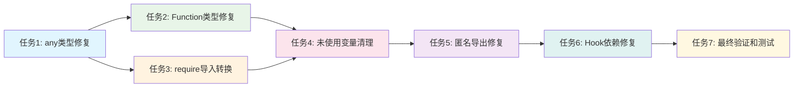

# 任务拆分文档 - 代码质量修复

## 任务列表

### 任务1：any类型修复

#### 输入契约

- 前置依赖：项目类型定义体系完整
- 输入数据：包含any类型的TypeScript文件
- 环境依赖：TypeScript编译器、ESLint

#### 输出契约

- 输出数据：替换any类型为具体类型的代码文件
- 交付物：修复后的TypeScript文件
- 验收标准：ESLint检查通过，TypeScript编译无错误

#### 实现约束

- 技术栈：TypeScript、ESLint、AST解析
- 接口规范：保持现有API接口不变
- 质量要求：类型安全性提升，代码可读性改善

#### 依赖关系

- 后置任务：Function类型修复
- 并行任务：require导入转换

### 任务2：Function类型修复

#### 输入契约

- 前置依赖：any类型修复完成
- 输入数据：包含Function类型的TypeScript文件
- 环境依赖：TypeScript编译器、函数签名分析器

#### 输出契约

- 输出数据：替换Function类型为具体函数签名的代码文件
- 交付物：修复后的TypeScript文件
- 验收标准：函数调用类型安全，ESLint检查通过

#### 实现约束

- 技术栈：TypeScript、函数签名推断
- 接口规范：保持回调函数接口不变
- 质量要求：函数类型明确，调用安全性提升

#### 依赖关系

- 前置任务：any类型修复
- 后置任务：变量清理
- 并行任务：require导入转换

### 任务3：require导入转换

#### 输入契约

- 前置依赖：无
- 输入数据：包含require导入的JavaScript/TypeScript文件
- 环境依赖：模块解析器、文件系统API

#### 输出契约

- 输出数据：转换为ES6 import语法的代码文件
- 交付物：修复后的导入语句
- 验收标准：模块加载正常，导入语法统一

#### 实现约束

- 技术栈：ES6模块系统、模块解析
- 接口规范：保持模块导出/导入功能不变
- 质量要求：导入语法统一，模块系统一致性

#### 依赖关系

- 后置任务：变量清理
- 并行任务：any类型修复、Function类型修复

### 任务4：未使用变量清理

#### 输入契约

- 前置依赖：类型修复完成
- 输入数据：包含未使用变量的TypeScript文件
- 环境依赖：AST解析器、作用域分析器

#### 输出契约

- 输出数据：清理未使用变量的代码文件
- 交付物：优化后的代码文件
- 验收标准：无未使用变量警告，代码简洁

#### 实现约束

- 技术栈：AST分析、作用域分析
- 接口规范：保持变量作用域不变
- 质量要求：代码简洁，无冗余声明

#### 依赖关系

- 前置任务：any类型修复、Function类型修复、require导入转换
- 后置任务：代码规范修复

### 任务5：匿名导出修复

#### 输入契约

- 前置依赖：变量清理完成
- 输入数据：包含匿名默认导出的文件
- 环境依赖：ESLint规则引擎

#### 输出契约

- 输出数据：添加命名导出的代码文件
- 交付物：修复后的导出语句
- 验收标准：导出语句明确，ESLint检查通过

#### 实现约束

- 技术栈：ESLint、代码生成
- 接口规范：保持导出功能不变
- 质量要求：导出语句明确，代码可读性提升

#### 依赖关系

- 前置任务：变量清理
- 后置任务：Hook依赖修复

### 任务6：React Hook依赖修复

#### 输入契约

- 前置依赖：匿名导出修复完成
- 输入数据：包含Hook依赖问题的React组件
- 环境依赖：React Hook规则、依赖分析器

#### 输出契约

- 输出数据：修复Hook依赖的React组件
- 交付物：优化后的React组件
- 验收标准：Hook依赖正确，无警告

#### 实现约束

- 技术栈：React Hook规则、依赖分析
- 接口规范：保持组件接口不变
- 质量要求：Hook使用规范，性能优化

#### 依赖关系

- 前置任务：匿名导出修复
- 后置任务：最终验证

### 任务7：最终验证和测试

#### 输入契约

- 前置依赖：所有修复任务完成
- 输入数据：修复后的完整代码库
- 环境依赖：测试框架、构建工具

#### 输出契约

- 输出数据：验证报告和测试结果
- 交付物：质量报告、测试覆盖率报告
- 验收标准：所有测试通过，构建成功

#### 实现约束

- 技术栈：Jest、ESLint、TypeScript编译器
- 接口规范：保持所有API接口不变
- 质量要求：代码质量显著提升，功能完整性保持

#### 依赖关系

- 前置任务：所有其他任务
- 后置任务：无

## 依赖关系图

## 任务执行策略

### 并行执行策略

- **任务1和任务3**：可以并行执行，无依赖关系
- **任务2**：依赖任务1完成
- **任务4**：依赖任务1、2、3完成
- **任务5**：依赖任务4完成
- **任务6**：依赖任务5完成
- **任务7**：依赖所有任务完成

### 风险控制策略

- **备份机制**：每个任务开始前备份原始文件
- **回滚机制**：任务失败时自动回滚
- **验证机制**：每个任务完成后立即验证
- **增量处理**：分批处理，避免大规模修改

### 质量保证策略

- **代码审查**：每个修复任务完成后进行代码审查
- **测试验证**：修复后立即运行相关测试
- **性能监控**：监控修复过程中的性能影响
- **用户反馈**：关键修复点征求用户确认

## 验收标准

### 功能验收

- [ ] 所有any类型已替换为具体类型
- [ ] 所有Function类型已替换为具体函数签名
- [ ] 所有require导入已改为ES6导入
- [ ] 所有未使用变量已清理
- [ ] 所有匿名导出已修复
- [ ] 所有Hook依赖问题已修复

### 质量验收

- [ ] ESLint检查通过
- [ ] TypeScript编译无错误
- [ ] 所有测试通过
- [ ] 代码覆盖率不降低
- [ ] 性能无显著下降
- [ ] 代码可读性提升

### 交付验收

- [ ] 修复报告完整
- [ ] 代码变更记录清晰
- [ ] 文档更新及时
- [ ] 用户培训完成
- [ ] 回滚方案准备就绪
