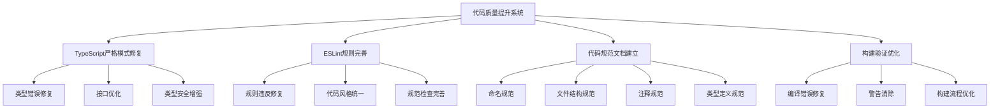

# 设计文档 - 代码质量提升

## 架构概览

### 整体架构图



## 核心组件

### 1. TypeScript严格模式修复组件

**职责：**

- 检查并修复所有严格模式类型错误
- 优化类型定义和接口设计
- 确保类型安全性和代码健壮性

**接口：**

```typescript
interface TypeScriptFixer {
  checkStrictModeErrors(): TypeScriptError[];
  fixTypeErrors(errors: TypeScriptError[]): FixResult;
  optimizeTypeDefinitions(): OptimizationResult;
}
```

**依赖：**

- TypeScript编译器
- 类型检查器

### 2. ESLint规则完善组件

**职责：**

- 检查并修复所有ESLint规则违反
- 优化代码风格和规范
- 确保代码一致性和可读性

**接口：**

```typescript
interface ESLintFixer {
  checkRuleViolations(): ESLintViolation[];
  fixViolations(violations: ESLintViolation[]): FixResult;
  optimizeCodeStyle(): StyleResult;
}
```

**依赖：**

- ESLint规则引擎
- 代码格式化工具

### 3. 代码规范文档组件

**职责：**

- 建立全面的代码规范文档
- 提供代码质量检查流程
- 维护规范文档的时效性

**接口：**

```typescript
interface CodeStandardManager {
  createStandards(): CodeStandards;
  validateCode(standards: CodeStandards): ValidationResult;
  updateStandards(): UpdateResult;
}
```

**依赖：**

- 文档生成工具
- 代码分析器

### 4. 构建验证组件

**职责：**

- 确保TypeScript编译无错误
- 确保ESLint检查无违规
- 确保构建过程无警告

**接口：**

```typescript
interface BuildValidator {
  validateTypeScript(): ValidationResult;
  validateESLint(): ValidationResult;
  validateBuild(): BuildResult;
}
```

**依赖：**

- 构建工具
- 质量检查工具

## 接口设计

### TypeScript修复接口

```typescript
interface TypeScriptFixer {
  // 检查严格模式错误
  checkStrictModeErrors(): Promise<TypeScriptError[]>;

  // 修复类型错误
  fixTypeErrors(errors: TypeScriptError[]): Promise<FixResult>;

  // 优化类型定义
  optimizeTypeDefinitions(): Promise<OptimizationResult>;
}

interface TypeScriptError {
  file: string;
  line: number;
  column: number;
  message: string;
  code: string;
  severity: 'error' | 'warning';
}
```

### ESLint修复接口

```typescript
interface ESLintFixer {
  // 检查规则违反
  checkRuleViolations(): Promise<ESLintViolation[]>;

  // 修复违规
  fixViolations(violations: ESLintViolation[]): Promise<FixResult>;

  // 优化代码风格
  optimizeCodeStyle(): Promise<StyleResult>;
}

interface ESLintViolation {
  file: string;
  line: number;
  column: number;
  message: string;
  rule: string;
  severity: 'error' | 'warning';
}
```

## 数据模型

### 错误信息模型

```typescript
interface CodeQualityError {
  id: string;
  type: 'typescript' | 'eslint';
  file: string;
  line: number;
  column: number;
  message: string;
  rule?: string;
  severity: 'error' | 'warning';
  fixable: boolean;
  suggestedFix?: string;
}

interface FixResult {
  success: boolean;
  fixedErrors: string[];
  remainingErrors: CodeQualityError[];
  warnings: string[];
}
```

### 代码规范模型

```typescript
interface CodeStandards {
  naming: NamingConventions;
  fileStructure: FileStructureRules;
  comments: CommentRules;
  types: TypeDefinitionRules;
  formatting: FormattingRules;
}

interface NamingConventions {
  variables: 'camelCase';
  functions: 'camelCase';
  classes: 'PascalCase';
  interfaces: 'PascalCase';
  types: 'PascalCase';
  constants: 'UPPER_SNAKE_CASE';
  files: 'kebab-case';
}
```

## 异常处理策略

### 错误分类

1. **TypeScript编译错误** - 必须修复
2. **ESLint规则违反** - 必须修复
3. **构建警告** - 建议修复
4. **代码风格问题** - 建议优化

### 处理策略

1. **自动修复** - 对于可自动修复的问题
2. **手动修复** - 对于需要人工判断的问题
3. **规则调整** - 对于不合理的规则配置
4. **文档更新** - 对于规范不明确的问题

## 质量保障

### 代码质量检查

- TypeScript严格模式检查
- ESLint规则检查
- 代码规范检查
- 构建验证检查

### 持续集成

- 自动化代码质量检查
- 代码规范验证
- 构建状态监控
- 质量报告生成
