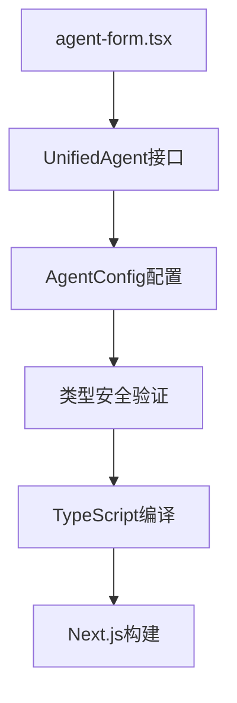

# 设计文档 - 修复智能体类型错误

## 架构概览

### 整体架构图



## 核心组件

### 1. 类型结构重构

#### 问题分析
当前 `agentData` 对象结构不符合 `UnifiedAgent` 接口：
- 配置信息分散在顶层和 `config` 对象中
- 存在属性重复定义
- 缺少必需的 `config` 属性

#### 解决方案
```typescript
// 修复前的问题结构
const agentData = {
  // 顶层属性
  id, name, description, type,
  apiUrl, apiKey, appId,
  systemPrompt, temperature, maxTokens,
  supportsFileUpload, supportsImageUpload,
  supportsStream, supportsDetail,
  globalVariables, welcomeText, order,

  // 部分配置在config中
  config: {
    version: '1.0.0',
    type: agentType,
    // ... 重复的配置
  }
}

// 修复后的正确结构
const agentData: UnifiedAgent = {
  // 基础标识
  id, name, description, type,

  // 显示属性
  welcomeText,

  // 排序和状态
  order, isPublished, isActive: true,

  // API配置
  apiUrl, apiKey, appId,

  // 模型配置
  systemPrompt, temperature, maxTokens, multimodalModel,

  // 功能支持
  supportsFileUpload, supportsImageUpload,
  supportsStream: true, supportsDetail: true,

  // 全局变量
  globalVariables,

  // 统一配置（必需）
  config: {
    version: '1.0.0',
    type: agentType,
    // 所有配置属性
    settings: { /* 设置 */ },
    features: { /* 功能 */ },
    limits: { /* 限制 */ }
  }
}
```

### 2. 配置映射策略

#### 配置分离原则
- **顶层属性**：基础标识、显示属性、状态属性
- **config属性**：详细配置、设置、功能、限制

#### 映射规则
```typescript
// 基础属性映射
const baseProperties = {
  id, name, description, type,
  welcomeText, order, isPublished, isActive: true
}

// API配置映射
const apiConfig = {
  apiUrl, apiKey, appId,
  systemPrompt, temperature, maxTokens, multimodalModel
}

// 功能配置映射
const featureConfig = {
  supportsFileUpload, supportsImageUpload,
  supportsStream: true, supportsDetail: true,
  globalVariables
}

// 统一配置对象
const config: AgentConfig = {
  version: '1.0.0',
  type: agentType,
  ...apiConfig,
  ...featureConfig,
  settings: { /* 默认设置 */ },
  features: { /* 功能特性 */ },
  limits: { /* 使用限制 */ }
}
```

## 接口设计

### UnifiedAgent接口要求

```typescript
interface UnifiedAgent {
  // 必需的基础属性
  id: string;
  name: string;
  description: string;
  type: AgentType;
  isActive: boolean;
  supportsStream: boolean;
  supportsDetail: boolean;

  // 可选的显示属性
  welcomeText?: string;
  order?: number;
  isPublished?: boolean;

  // API配置
  apiUrl?: string;
  apiKey?: string;
  appId?: string;

  // 模型配置
  systemPrompt?: string;
  temperature?: number;
  maxTokens?: number;
  multimodalModel?: string;

  // 功能支持
  supportsFileUpload?: boolean;
  supportsImageUpload?: boolean;
  globalVariables?: GlobalVariable[];

  // 必需的配置对象
  config: AgentConfig;
}
```

### AgentConfig接口结构

```typescript
interface AgentConfig {
  version: string;
  type?: AgentType;
  // 基础配置
  id?: string;
  name?: string;
  description?: string;
  // API配置
  apiKey?: string;
  appId?: string;
  apiUrl?: string;
  // 模型配置
  systemPrompt?: string;
  temperature?: number;
  maxTokens?: number;
  multimodalModel?: string;
  // 功能配置
  supportsFileUpload?: boolean;
  supportsImageUpload?: boolean;
  supportsStream?: boolean;
  supportsDetail?: boolean;
  globalVariables?: GlobalVariable[];
  welcomeText?: string;
  order?: number;
  isPublished?: boolean;
  isActive?: boolean;
  // 详细配置
  settings: AgentSettings;
  features: AgentFeatures;
  limits: AgentLimits;
}
```

## 数据流向图


## 异常处理策略

### 1. 类型检查异常
- 使用 TypeScript 严格模式确保类型安全
- 在构建时捕获类型错误
- 提供清晰的错误信息

### 2. 配置缺失异常
- 为必需属性提供默认值
- 验证配置完整性
- 记录配置错误日志

### 3. 运行时异常
- 保持现有错误处理机制
- 确保向后兼容性
- 提供降级处理方案
