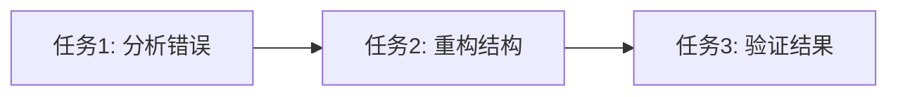

# 任务拆分文档 - 修复智能体类型错误

## 任务列表

### 任务1：分析当前类型错误
#### 输入契约
- 前置依赖：无
- 输入数据：agent-form.tsx 文件内容
- 环境依赖：TypeScript 编译环境

#### 输出契约
- 输出数据：错误分析报告
- 交付物：问题定位和根因分析
- 验收标准：明确错误位置和修复方向

#### 实现约束
- 技术栈：TypeScript, Next.js
- 接口规范：UnifiedAgent 接口
- 质量要求：准确识别问题

### 任务2：重构agentData对象结构
#### 输入契约
- 前置依赖：任务1完成
- 输入数据：当前agentData构建逻辑
- 环境依赖：TypeScript 类型定义

#### 输出契约
- 输出数据：符合UnifiedAgent接口的agentData对象
- 交付物：重构后的代码
- 验收标准：通过TypeScript类型检查

#### 实现约束
- 技术栈：TypeScript
- 接口规范：UnifiedAgent, AgentConfig
- 质量要求：类型安全，无重复配置

### 任务3：验证修复结果
#### 输入契约
- 前置依赖：任务2完成
- 输入数据：修复后的代码
- 环境依赖：Next.js构建环境

#### 输出契约
- 输出数据：构建成功结果
- 交付物：通过所有检查的代码
- 验收标准：TypeScript编译无错误，Next.js构建成功

#### 实现约束
- 技术栈：TypeScript, Next.js
- 接口规范：严格类型检查
- 质量要求：生产环境可部署

## 依赖关系图



## 核心组件

### 1. 类型错误分析器
- 职责：定位TypeScript类型错误
- 接口：分析agent-form.tsx中的类型问题
- 依赖：UnifiedAgent类型定义

### 2. 对象结构重构器
- 职责：重构agentData对象结构
- 接口：将分散配置统一到config对象
- 依赖：AgentConfig接口定义

### 3. 类型验证器
- 职责：验证修复后的类型正确性
- 接口：确保符合UnifiedAgent接口
- 依赖：TypeScript编译器

## 接口设计

### 修复策略接口

```typescript
interface FixStrategy {
  // 分析当前问题
  analyzeError(): TypeErrorAnalysis;

  // 重构对象结构
  refactorAgentData(): UnifiedAgent;

  // 验证修复结果
  validateFix(): ValidationResult;
}
```

### 类型分析接口

```typescript
interface TypeErrorAnalysis {
  errorLocation: string;
  missingProperties: string[];
  duplicateProperties: string[];
  suggestedFix: string;
}
```

### 验证结果接口

```typescript
interface ValidationResult {
  typeCheckPassed: boolean;
  buildSuccessful: boolean;
  errors: string[];
  warnings: string[];
}
```

## 数据模型

### 修复前的agentData结构
```typescript
interface CurrentAgentData {
  // 分散的配置属性
  id: string;
  name: string;
  description: string;
  // ... 其他顶层属性
  config: Partial<AgentConfig>; // 不完整的配置
}
```

### 修复后的agentData结构
```typescript
interface FixedAgentData extends UnifiedAgent {
  // 符合UnifiedAgent接口的完整结构
  config: AgentConfig; // 完整的配置对象
}
```
