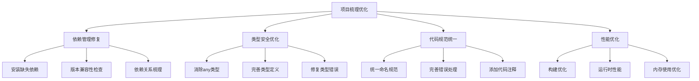
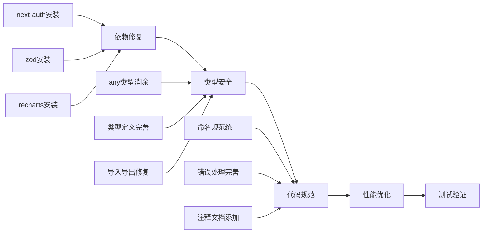
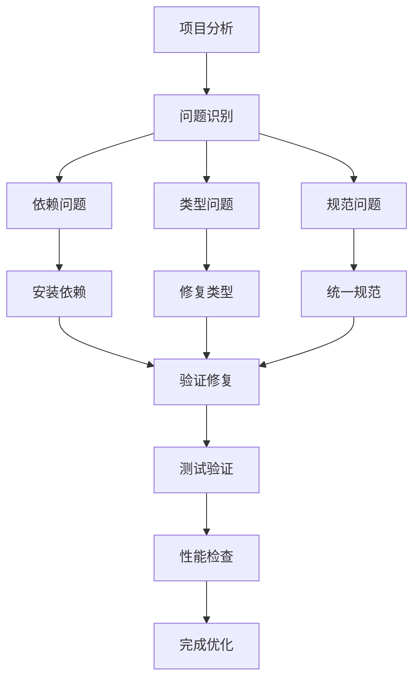

# 设计文档 - 全局项目梳理优化

## 架构概览

### 整体架构图



## 分层设计和核心组件

### 1. 依赖管理层
- **职责**: 管理项目依赖和版本兼容性
- **组件**: package.json, node_modules
- **优化策略**: 安装缺失依赖，版本对齐

### 2. 类型安全层
- **职责**: 确保TypeScript类型安全
- **组件**: tsconfig.json, 类型定义文件
- **优化策略**: 严格类型检查，消除any类型

### 3. 代码规范层
- **职责**: 统一代码风格和质量
- **组件**: ESLint配置, Prettier配置
- **优化策略**: 自动化代码格式化，规范检查

### 4. 性能优化层
- **职责**: 提升项目性能和用户体验
- **组件**: Next.js配置, 构建优化
- **优化策略**: 代码分割，资源优化

## 模块依赖关系图



## 接口契约定义

### 1. 依赖管理接口
```typescript
interface DependencyManager {
  installMissingDependencies(): Promise<void>;
  checkVersionCompatibility(): Promise<boolean>;
  updatePackageJson(deps: Record<string, string>): void;
}
```

### 2. 类型安全接口
```typescript
interface TypeSafetyManager {
  eliminateAnyTypes(): Promise<void>;
  addTypeDefinitions(): Promise<void>;
  fixTypeErrors(): Promise<void>;
}
```

### 3. 代码规范接口
```typescript
interface CodeQualityManager {
  enforceNamingConventions(): Promise<void>;
  addErrorHandling(): Promise<void>;
  addDocumentation(): Promise<void>;
}
```

## 数据流向图



## 异常处理策略

### 1. 依赖安装失败
- **策略**: 回滚到稳定版本，记录错误日志
- **恢复**: 手动安装依赖，检查网络连接

### 2. 类型检查失败
- **策略**: 逐步修复类型错误，保持功能可用
- **恢复**: 临时使用类型断言，后续完善

### 3. 构建失败
- **策略**: 分析错误原因，分步修复
- **恢复**: 回滚到可构建版本，增量修复

### 4. 测试失败
- **策略**: 修复测试用例，确保功能正确
- **恢复**: 更新测试数据，调整测试逻辑

## 优化策略

### 1. 渐进式优化
- 先修复关键问题，再优化细节
- 保持功能可用性，避免破坏性变更
- 分阶段验证，确保每步都正确

### 2. 自动化验证
- 使用CI/CD流程自动检查
- 集成代码质量检查工具
- 自动化测试和性能监控

### 3. 文档同步
- 实时更新相关文档
- 记录所有变更和决策
- 保持文档与代码同步
