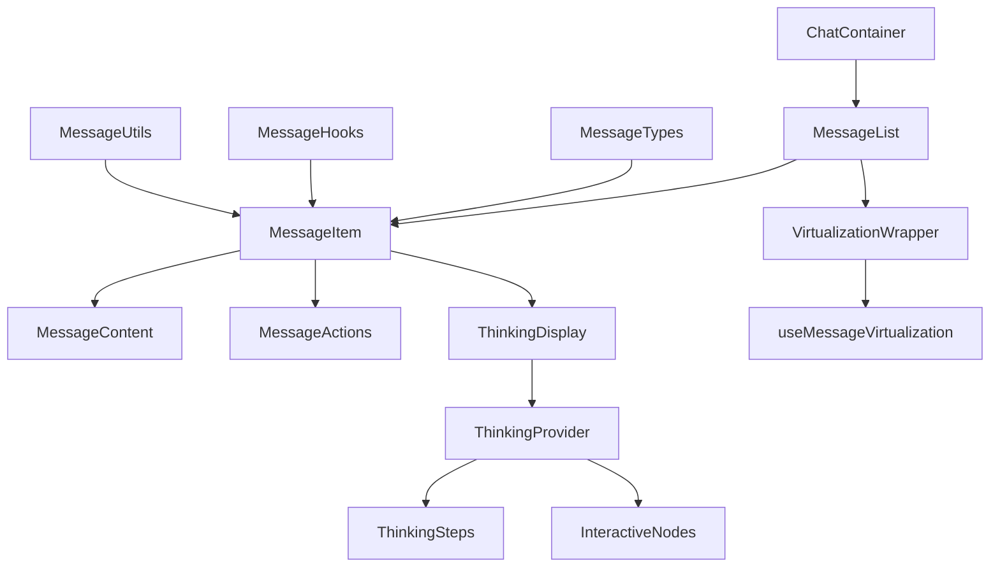

# 设计文档 - 对话界面重构

## 架构概览

### 整体架构图



## 核心组件

### 1. ChatContainer (聊天容器)

**职责：**

- 管理聊天状态和消息列表
- 提供消息操作回调
- 处理消息虚拟化

**接口：**

```typescript
interface ChatContainerProps {
  messages: Message[];
  onSendMessage: (content: string) => void;
  onEditMessage: (id: string, content: string) => void;
  onDeleteMessage: (id: string) => void;
  onRegenerateMessage: (id: string) => void;
  className?: string;
}
```

### 2. MessageList (消息列表)

**职责：**

- 渲染消息列表
- 处理滚动和虚拟化
- 管理消息状态

**接口：**

```typescript
interface MessageListProps {
  messages: Message[];
  renderMessage: (message: Message, index: number) => React.ReactNode;
  enableVirtualization?: boolean;
  className?: string;
}
```

### 3. MessageItem (消息项)

**职责：**

- 单个消息的容器
- 处理消息交互
- 管理消息状态

**接口：**

```typescript
interface MessageItemProps {
  message: Message;
  onEdit?: (id: string, content: string) => void;
  onDelete?: (id: string) => void;
  onRegenerate?: (id: string) => void;
  onCopy?: (content: string) => void;
  className?: string;
}
```

### 4. MessageContent (消息内容)

**职责：**

- 渲染消息内容
- 处理Markdown渲染
- 显示媒体内容

**接口：**

```typescript
interface MessageContentProps {
  content: string;
  role: MessageRole;
  metadata?: MessageMetadata;
  className?: string;
}
```

### 5. ThinkingDisplay (思考展示)

**职责：**

- 统一处理thinking流程
- 显示处理步骤
- 管理交互节点

**接口：**

```typescript
interface ThinkingDisplayProps {
  thinkingSteps: ProcessingStep[];
  interactiveData?: InteractiveData;
  thinkingStatus: ThinkingStatus;
  interactionStatus: InteractionStatus;
  onInteractiveSelect?: (value: string, key: string) => void;
  className?: string;
}
```

## 状态管理

### ThinkingProvider

**职责：**

- 管理thinking状态
- 提供thinking相关方法
- 处理thinking数据流

**接口：**

```typescript
interface ThinkingContextValue {
  thinkingSteps: ProcessingStep[];
  thinkingStatus: ThinkingStatus;
  interactionStatus: InteractionStatus;
  interactiveData?: InteractiveData;
  updateThinkingSteps: (steps: ProcessingStep[]) => void;
  updateThinkingStatus: (status: ThinkingStatus) => void;
  updateInteractionStatus: (status: InteractionStatus) => void;
  onInteractiveSelect: (value: string, key: string) => void;
}
```

### useMessageVirtualization

**职责：**

- 管理消息虚拟化
- 处理滚动逻辑
- 优化渲染性能

**接口：**

```typescript
interface UseMessageVirtualizationOptions {
  messages: Message[];
  containerHeight: number;
  enableVirtualization: boolean;
  estimateSize?: (index: number) => number;
}
```

## 类型定义优化

### 统一消息类型

```typescript
// 基础消息类型
interface BaseMessage {
  id: string;
  content: string;
  role: MessageRole;
  timestamp: Date;
  metadata?: MessageMetadata;
}

// 用户消息
interface UserMessage extends BaseMessage {
  role: 'user';
}

// AI消息
interface AIMessage extends BaseMessage {
  role: 'assistant';
  thinkingSteps?: ProcessingStep[];
  interactiveData?: InteractiveData;
  thinkingStatus?: ThinkingStatus;
  interactionStatus?: InteractionStatus;
}

// 联合类型
type Message = UserMessage | AIMessage;
```

### 统一Thinking类型

```typescript
// 思考状态
type ThinkingStatus = 'idle' | 'thinking' | 'completed' | 'error';

// 交互状态
type InteractionStatus = 'none' | 'ready' | 'completed';

// 处理步骤
interface ProcessingStep {
  id: string;
  type: string;
  name?: string;
  content?: string;
  status?: 'pending' | 'processing' | 'completed' | 'error';
  timestamp?: Date;
}

// 交互数据
interface InteractiveData {
  type: 'userSelect' | 'confirmation' | 'input';
  params?: Record<string, unknown>;
  processed?: boolean;
  selectedValue?: string;
  selectedKey?: string;
  selectedAt?: Date;
}
```

## 组件拆分策略

### 1. ChatMessage 拆分

**原组件问题：**

- 794行代码，过于复杂
- 职责不清晰
- 难以维护

**拆分方案：**

```
ChatMessage (794行)
├── MessageItem (容器组件)
├── MessageContent (内容展示)
├── MessageActions (操作按钮)
├── ThinkingDisplay (思考展示)
└── MessageMetadata (元数据展示)
```

### 2. 重复组件合并

**合并目标：**

- `EnhancedThinkingBubble` + `InlineBubbleInteractive` → `ThinkingDisplay`
- `VirtualizedMessageList` + `MessageList` → `MessageList` (可配置)
- 多个thinking相关Hook → `useThinking`

### 3. 状态管理集中化

**集中化目标：**

- 创建 `ThinkingProvider` 统一管理thinking状态
- 创建 `MessageProvider` 统一管理消息状态
- 合并重复的状态逻辑

## 性能优化

### 1. 虚拟化优化

- 统一虚拟化逻辑
- 优化滚动性能
- 减少不必要的重渲染

### 2. 组件优化

- 使用 `React.memo` 优化重渲染
- 使用 `useCallback` 优化函数引用
- 使用 `useMemo` 优化计算

### 3. 状态优化

- 减少不必要的状态更新
- 使用状态合并减少重渲染
- 优化状态订阅机制

## 实现计划

### 阶段1：类型定义统一

1. 创建统一的类型定义
2. 重构现有类型
3. 确保类型安全

### 阶段2：组件拆分

1. 拆分ChatMessage组件
2. 创建独立的功能组件
3. 重构现有组件

### 阶段3：状态管理集中化

1. 创建Provider组件
2. 实现统一的状态管理
3. 重构现有Hook

### 阶段4：性能优化

1. 实现虚拟化优化
2. 优化组件渲染
3. 性能测试和调优

### 阶段5：测试和验证

1. 功能测试
2. 性能测试
3. 代码质量检查
