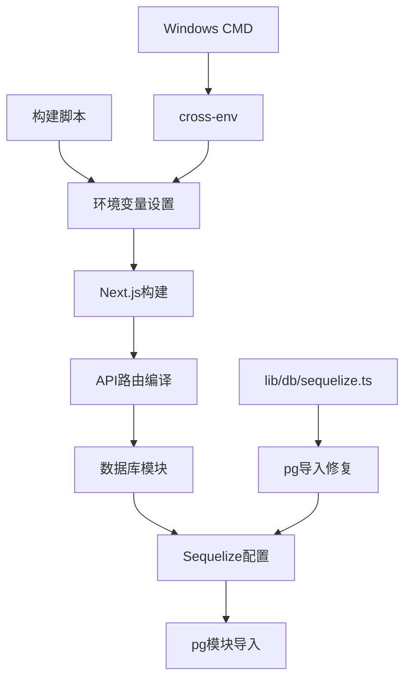

# 设计文档 - 构建错误修复

## 架构概览

### 整体架构图

## 核心组件

### 1. 构建脚本修复

- **职责**：提供跨平台的构建环境
- **接口**：package.json scripts
- **依赖**：cross-env包

### 2. 数据库模块修复

- **职责**：正确导入和使用pg模块
- **接口**：Sequelize配置
- **依赖**：pg包

## 接口设计

### 构建脚本规范

- Windows兼容的环境变量设置
- 跨平台构建支持
- 内存优化配置

### 数据库连接规范

- 正确的pg模块导入
- Sequelize dialectModule配置
- 保持现有连接逻辑

## 数据模型

### 构建配置

- 环境变量：NODE_OPTIONS
- 构建目标：生产构建
- 平台支持：Windows/Linux/macOS

### 数据库配置

- 连接模块：pg
- ORM：Sequelize
- 数据库：PostgreSQL

## 异常处理策略

### 构建错误处理

- 环境变量设置失败时的降级方案
- 模块导入失败时的错误提示
- 构建过程中的错误恢复

### 数据库连接处理

- pg模块导入失败时的错误处理
- Sequelize配置验证
- 连接失败时的降级方案
