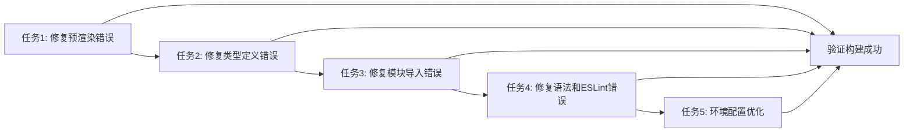

# 任务拆分文档 - 构建错误修复

## 任务列表

### 任务1：修复预渲染错误

#### 输入契约

- 前置依赖：无
- 输入数据：当前构建错误日志
- 环境依赖：Next.js 14.0.4, TypeScript 5.x

#### 输出契约

- 输出数据：修复后的组件文件
- 交付物：
  - 修复 `indexedDB is not defined` 错误
  - 修复 `useAgent must be used within a AgentProvider` 错误
  - 修复 `PerformanceReportGenerator is not defined` 错误
- 验收标准：预渲染过程无错误，构建成功

#### 实现约束

- 技术栈：Next.js, React, TypeScript
- 接口规范：保持现有API不变
- 质量要求：添加服务端渲染保护机制

### 任务2：修复类型定义错误

#### 输入契约

- 前置依赖：任务1完成
- 输入数据：语音服务相关类型文件
- 环境依赖：TypeScript 5.x

#### 输出契约

- 输出数据：修复后的类型定义文件
- 交付物：
  - 修复 `VoiceErrorType` 类型错误
  - 修复 `VoiceEventType` 类型错误
  - 完善语音服务接口定义
  - 修复测试文件类型定义
- 验收标准：TypeScript编译无错误

#### 实现约束

- 技术栈：TypeScript, Jest
- 接口规范：保持现有接口不变
- 质量要求：类型安全性，无any类型

### 任务3：修复模块导入错误

#### 输入契约

- 前置依赖：任务2完成
- 输入数据：package.json, 导入语句
- 环境依赖：npm, Node.js

#### 输出契约

- 输出数据：修复后的导入语句和依赖配置
- 交付物：
  - 修复 `pg` 模块导入问题
  - 修复 `handleApiError` 导入问题
  - 修复 `bcryptjs` 模块导入问题
  - 确保所有依赖正确安装
- 验收标准：所有模块导入正常，无模块未找到错误

#### 实现约束

- 技术栈：Node.js, npm, TypeScript
- 接口规范：保持现有API不变
- 质量要求：依赖版本兼容性

### 任务4：修复语法和ESLint错误

#### 输入契约

- 前置依赖：任务3完成
- 输入数据：ESLint错误报告
- 环境依赖：ESLint, Prettier

#### 输出契约

- 输出数据：修复后的代码文件
- 交付物：
  - 修复JSX语法错误
  - 修复缺少分号等语法错误
  - 修复ESLint警告
  - 统一代码风格
- 验收标准：ESLint检查通过，代码风格统一

#### 实现约束

- 技术栈：ESLint, Prettier, TypeScript
- 接口规范：遵循项目代码规范
- 质量要求：代码可读性，无冗余代码

### 任务5：环境配置优化

#### 输入契约

- 前置依赖：任务4完成
- 输入数据：构建配置文件
- 环境依赖：Windows, WSL, cross-env

#### 输出契约

- 输出数据：优化后的配置文件
- 交付物：
  - 修复 `cross-env` 配置问题
  - 优化 Next.js 构建配置
  - 确保 Windows 环境兼容性
  - 优化构建性能
- 验收标准：构建过程稳定，Windows环境兼容

#### 实现约束

- 技术栈：Next.js, cross-env, Windows
- 接口规范：保持现有构建流程
- 质量要求：构建时间合理，内存使用优化

## 依赖关系图



## 核心组件

### 预渲染保护组件

- 职责：为使用浏览器API的组件提供服务端渲染保护
- 接口：`withSSRProtection` HOC
- 依赖：React, Next.js

### 类型定义模块

- 职责：提供完整的类型定义
- 接口：语音服务相关类型接口
- 依赖：TypeScript

### 模块导入管理器

- 职责：管理所有模块导入和依赖
- 接口：统一的导入规范
- 依赖：Node.js, npm

### 代码质量检查器

- 职责：确保代码质量和规范
- 接口：ESLint, Prettier配置
- 依赖：ESLint, Prettier

### 构建配置管理器

- 职责：管理构建配置和环境
- 接口：Next.js配置, cross-env配置
- 依赖：Next.js, cross-env

## 接口设计

### 预渲染保护接口

```typescript
interface SSRProtectionOptions {
  fallback?: React.ReactNode;
  clientOnly?: boolean;
  onError?: (error: Error) => void;
}

function withSSRProtection<T extends object>(
  Component: React.ComponentType<T>,
  options?: SSRProtectionOptions
): React.ComponentType<T>;
```

### 类型定义接口

```typescript
interface VoiceErrorType {
  // 语音错误类型定义
}

interface VoiceEventType {
  // 语音事件类型定义
}

interface VoiceService {
  // 语音服务接口定义
}
```

### 模块导入接口

```typescript
// 统一的模块导入规范
import { ModuleName } from '@/path/to/module';
import type { TypeName } from '@/types/module';
```

## 数据模型

### 错误信息模型

```typescript
interface BuildError {
  type: 'typescript' | 'eslint' | 'runtime' | 'prerender';
  severity: 'error' | 'warning';
  message: string;
  file: string;
  line?: number;
  column?: number;
}
```

### 修复状态模型

```typescript
interface FixStatus {
  taskId: string;
  status: 'pending' | 'in_progress' | 'completed' | 'failed';
  errors: BuildError[];
  fixes: string[];
  timestamp: Date;
}
```
