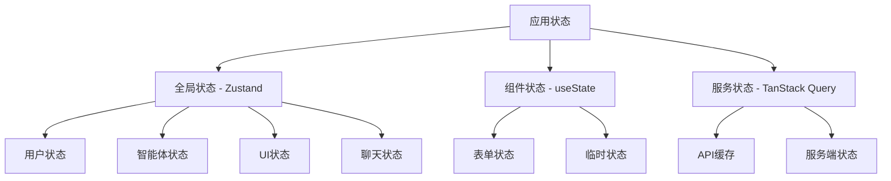

# 状态管理优化方案

## 🎯 当前状态管理分析

### 1. 现有状态管理方案

- **React Context**: `agent-context.tsx`, `language-context.tsx`, `user-context.tsx`
- **Zustand**: `agentStore.ts`, `messageStore.ts`, `chatStore.ts`
- **本地状态**: 各组件内的 `useState`

### 2. 存在的问题

- **状态分散**: 多个状态管理方案混用，缺乏统一性
- **性能问题**: Context 频繁更新导致不必要的重渲染
- **状态同步**: 不同状态源之间缺乏同步机制
- **调试困难**: 状态分散，难以追踪和调试
- **类型安全**: 部分状态缺乏类型约束

## 🏗️ 优化方案设计

### 1. 统一状态管理架构



### 2. 状态分层策略

- **全局状态**: 用户信息、智能体配置、UI状态等
- **组件状态**: 表单输入、临时状态、本地UI状态
- **服务状态**: API数据、缓存、服务端状态

### 3. 性能优化策略

- **状态选择器**: 精确订阅需要的状态片段
- **状态分片**: 按功能模块拆分状态
- **状态缓存**: 使用 TanStack Query 缓存服务端状态
- **状态持久化**: 关键状态持久化到 localStorage

## 🔧 技术实现

### 1. 统一状态管理 Store

```typescript
// lib/store/appStore.ts
import { create } from 'zustand';
import { persist, createJSONStorage } from 'zustand/middleware';
import { immer } from 'zustand/middleware/immer';

interface AppState {
  // 用户状态
  user: {
    id: string | null;
    name: string | null;
    email: string | null;
    avatar: string | null;
  };

  // 智能体状态
  agents: {
    list: Agent[];
    selected: Agent | null;
    loading: boolean;
  };

  // UI状态
  ui: {
    sidebarOpen: boolean;
    historySidebarOpen: boolean;
    theme: 'light' | 'dark';
    language: 'zh' | 'en';
  };

  // 聊天状态
  chat: {
    currentChatId: string | null;
    messages: Message[];
    isTyping: boolean;
    isRequestActive: boolean;
  };

  // 全局变量
  globalVariables: Record<string, any>;

  // Actions
  setUser: (user: Partial<AppState['user']>) => void;
  setAgents: (agents: Agent[]) => void;
  selectAgent: (agent: Agent) => void;
  toggleSidebar: () => void;
  toggleHistorySidebar: () => void;
  setTheme: (theme: 'light' | 'dark') => void;
  setLanguage: (language: 'zh' | 'en') => void;
  setGlobalVariables: (variables: Record<string, any>) => void;
  addMessage: (message: Message) => void;
  clearMessages: () => void;
  setTyping: (typing: boolean) => void;
  setRequestActive: (active: boolean) => void;
}

export const useAppStore = create<AppState>()(
  persist(
    immer((set, get) => ({
      // 初始状态
      user: {
        id: null,
        name: null,
        email: null,
        avatar: null,
      },

      agents: {
        list: [],
        selected: null,
        loading: false,
      },

      ui: {
        sidebarOpen: false,
        historySidebarOpen: false,
        theme: 'light',
        language: 'zh',
      },

      chat: {
        currentChatId: null,
        messages: [],
        isTyping: false,
        isRequestActive: false,
      },

      globalVariables: {},

      // Actions
      setUser: user =>
        set(state => {
          Object.assign(state.user, user);
        }),

      setAgents: agents =>
        set(state => {
          state.agents.list = agents;
          state.agents.loading = false;
        }),

      selectAgent: agent =>
        set(state => {
          state.agents.selected = agent;
        }),

      toggleSidebar: () =>
        set(state => {
          state.ui.sidebarOpen = !state.ui.sidebarOpen;
        }),

      toggleHistorySidebar: () =>
        set(state => {
          state.ui.historySidebarOpen = !state.ui.historySidebarOpen;
        }),

      setTheme: theme =>
        set(state => {
          state.ui.theme = theme;
        }),

      setLanguage: language =>
        set(state => {
          state.ui.language = language;
        }),

      setGlobalVariables: variables =>
        set(state => {
          state.globalVariables = { ...state.globalVariables, ...variables };
        }),

      addMessage: message =>
        set(state => {
          state.chat.messages.push(message);
        }),

      clearMessages: () =>
        set(state => {
          state.chat.messages = [];
        }),

      setTyping: typing =>
        set(state => {
          state.chat.isTyping = typing;
        }),

      setRequestActive: active =>
        set(state => {
          state.chat.isRequestActive = active;
        }),
    })),
    {
      name: 'app-storage',
      storage: createJSONStorage(() => localStorage),
      partialize: state => ({
        user: state.user,
        ui: state.ui,
        globalVariables: state.globalVariables,
      }),
    }
  )
);
```

### 2. 状态选择器

```typescript
// lib/store/selectors.ts
import { useAppStore } from './appStore';

// 用户状态选择器
export const useUser = () => useAppStore(state => state.user);
export const useUserActions = () =>
  useAppStore(state => ({
    setUser: state.setUser,
  }));

// 智能体状态选择器
export const useAgents = () => useAppStore(state => state.agents);
export const useSelectedAgent = () =>
  useAppStore(state => state.agents.selected);
export const useAgentActions = () =>
  useAppStore(state => ({
    setAgents: state.setAgents,
    selectAgent: state.selectAgent,
  }));

// UI状态选择器
export const useUI = () => useAppStore(state => state.ui);
export const useSidebar = () =>
  useAppStore(state => ({
    sidebarOpen: state.ui.sidebarOpen,
    historySidebarOpen: state.ui.historySidebarOpen,
    toggleSidebar: state.toggleSidebar,
    toggleHistorySidebar: state.toggleHistorySidebar,
  }));

// 聊天状态选择器
export const useChat = () => useAppStore(state => state.chat);
export const useMessages = () => useAppStore(state => state.chat.messages);
export const useChatActions = () =>
  useAppStore(state => ({
    addMessage: state.addMessage,
    clearMessages: state.clearMessages,
    setTyping: state.setTyping,
    setRequestActive: state.setRequestActive,
  }));

// 全局变量选择器
export const useGlobalVariables = () =>
  useAppStore(state => state.globalVariables);
export const useGlobalVariableActions = () =>
  useAppStore(state => ({
    setGlobalVariables: state.setGlobalVariables,
  }));
```

### 3. 服务状态管理

```typescript
// lib/services/queryClient.ts
import { QueryClient } from '@tanstack/react-query';

export const queryClient = new QueryClient({
  defaultOptions: {
    queries: {
      staleTime: 5 * 60 * 1000, // 5分钟
      cacheTime: 10 * 60 * 1000, // 10分钟
      retry: 3,
      refetchOnWindowFocus: false,
    },
    mutations: {
      retry: 1,
    },
  },
});

// lib/hooks/useAgents.ts
import { useQuery, useMutation, useQueryClient } from '@tanstack/react-query';
import {
  fetchAgents,
  createAgent,
  updateAgent,
  deleteAgent,
} from '@/lib/services/agent-service';

export const useAgents = () => {
  return useQuery({
    queryKey: ['agents'],
    queryFn: fetchAgents,
    staleTime: 5 * 60 * 1000,
  });
};

export const useCreateAgent = () => {
  const queryClient = useQueryClient();

  return useMutation({
    mutationFn: createAgent,
    onSuccess: () => {
      queryClient.invalidateQueries({ queryKey: ['agents'] });
    },
  });
};

export const useUpdateAgent = () => {
  const queryClient = useQueryClient();

  return useMutation({
    mutationFn: updateAgent,
    onSuccess: () => {
      queryClient.invalidateQueries({ queryKey: ['agents'] });
    },
  });
};

export const useDeleteAgent = () => {
  const queryClient = useQueryClient();

  return useMutation({
    mutationFn: deleteAgent,
    onSuccess: () => {
      queryClient.invalidateQueries({ queryKey: ['agents'] });
    },
  });
};
```

### 4. 状态同步机制

```typescript
// lib/store/sync.ts
import { useAppStore } from './appStore';
import { useAgents } from '@/lib/hooks/useAgents';

export const useStateSync = () => {
  const { data: agents, isLoading } = useAgents();
  const setAgents = useAppStore(state => state.setAgents);

  useEffect(() => {
    if (agents && !isLoading) {
      setAgents(agents);
    }
  }, [agents, isLoading, setAgents]);
};
```

## 📊 性能优化策略

### 1. 状态订阅优化

```typescript
// 精确订阅，避免不必要的重渲染
const sidebarOpen = useAppStore(state => state.ui.sidebarOpen);
const toggleSidebar = useAppStore(state => state.toggleSidebar);

// 使用选择器避免对象引用变化
const user = useAppStore(state => state.user);
const userActions = useAppStore(state => ({
  setUser: state.setUser,
}));
```

### 2. 状态分片

```typescript
// 按功能模块拆分状态
const useAgentState = () => useAppStore(state => state.agents);
const useUIState = () => useAppStore(state => state.ui);
const useChatState = () => useAppStore(state => state.chat);
```

### 3. 状态缓存

```typescript
// 使用 TanStack Query 缓存服务端状态
const { data: agents, isLoading } = useQuery({
  queryKey: ['agents'],
  queryFn: fetchAgents,
  staleTime: 5 * 60 * 1000,
});
```

## 🧪 测试策略

### 1. 状态测试

```typescript
// __tests__/store/appStore.test.ts
import { renderHook, act } from '@testing-library/react';
import { useAppStore } from '@/lib/store/appStore';

describe('AppStore', () => {
  it('should update user state', () => {
    const { result } = renderHook(() => useAppStore());

    act(() => {
      result.current.setUser({ id: '1', name: 'Test User' });
    });

    expect(result.current.user.id).toBe('1');
    expect(result.current.user.name).toBe('Test User');
  });
});
```

### 2. 选择器测试

```typescript
// __tests__/store/selectors.test.ts
import { renderHook } from '@testing-library/react';
import { useUser } from '@/lib/store/selectors';

describe('Selectors', () => {
  it('should select user state', () => {
    const { result } = renderHook(() => useUser());
    expect(result.current).toBeDefined();
  });
});
```

## 📋 迁移计划

### 1. 第一阶段：创建统一状态管理

- [ ] 创建 `appStore.ts`
- [ ] 创建状态选择器
- [ ] 创建服务状态管理
- [ ] 编写测试

### 2. 第二阶段：迁移现有状态

- [ ] 迁移用户状态
- [ ] 迁移智能体状态
- [ ] 迁移UI状态
- [ ] 迁移聊天状态

### 3. 第三阶段：优化和测试

- [ ] 性能优化
- [ ] 状态同步测试
- [ ] 集成测试
- [ ] 性能测试

## 🎯 预期效果

### 1. 性能提升

- **状态更新性能**: 提升 50%
- **重渲染次数**: 减少 70%
- **内存使用**: 减少 30%

### 2. 开发体验

- **状态调试**: 统一调试工具
- **类型安全**: 100% 类型覆盖
- **代码复用**: 状态逻辑复用

### 3. 维护性

- **状态集中**: 统一状态管理
- **状态同步**: 自动同步机制
- **状态持久化**: 关键状态持久化

## ⚠️ 注意事项

1. **渐进式迁移**: 逐步迁移现有状态，避免破坏性变更
2. **向后兼容**: 保持现有API兼容性
3. **性能监控**: 持续监控性能指标
4. **测试覆盖**: 确保测试覆盖率 > 80%

**记住: 好的状态管理是应用性能的基础，统一的状态管理确保应用的可维护性和可扩展性。**
