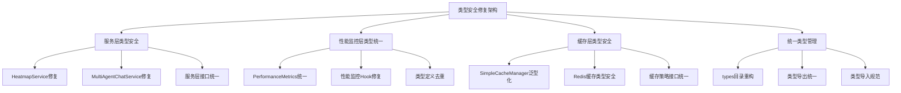

# 设计文档 - 类型安全修复

## 架构概览

### 整体架构图



## 分层设计和核心组件

### 1. 服务层类型安全设计

#### 核心组件

**HeatmapService类型修复**

```typescript
// 定义查询条件类型
interface WhereClause {
  startTime?: {
    [Op.between]: [Date, Date];
  };
  messageType?: string;
  userId?: string;
  '$agent.type$'?: string;
}

// 定义地理位置查询条件
interface GeoWhereClause {
  [key: string]: string | number;
}

// 修复后的方法签名
public async getHeatmapData(params: HeatmapQueryParams): Promise<HeatmapDataPoint[]>
```

**MultiAgentChatService类型修复**

```typescript
// 修复回调函数类型
export interface ChatServiceOptions {
  stream?: boolean;
  temperature?: number;
  maxTokens?: number;
  variables?: Record<string, unknown>; // 替换 any
  onChunk?: (chunk: string) => void;
  onProcessingStep?: (step: ProcessingStep) => void; // 具体类型
  onIntermediateValue?: (value: IntermediateValue, eventType: string) => void; // 具体类型
  onError?: (error: Error) => void;
  onStart?: () => void;
  onFinish?: () => void;
  signal?: AbortSignal;
}
```

### 2. 性能监控层类型统一设计

#### 核心组件

**PerformanceMetrics接口统一**

```typescript
// 保留 lib/performance/monitor.ts 中的定义
// 删除 types/api.ts 中的重复定义
// 统一导入路径

// 性能监控Hook类型匹配
export interface UsePerformanceMonitorReturn {
  metrics: PerformanceMetrics;
  summary: PerformanceSummary;
  isMonitoring: boolean;
  startMonitoring: () => void;
  stopMonitoring: () => void;
  resetMetrics: () => void;
  getReport: () => PerformanceReport;
}
```

### 3. 缓存层类型安全设计

#### 核心组件

**SimpleCacheManager泛型化**

```typescript
interface CacheEntry<T> {
  data: T;
  timestamp: number;
  ttl: number;
}

class SimpleCacheManager {
  private cache = new Map<string, CacheEntry<unknown>>(); // 替换 any

  async get<T>(key: string): Promise<T | null> {
    const entry = this.cache.get(key);
    if (!entry) return null;

    if (Date.now() - entry.timestamp > entry.ttl * 1000) {
      this.cache.delete(key);
      return null;
    }

    return entry.data as T;
  }

  async set<T>(
    key: string,
    data: T,
    ttl: number = this.defaultTTL
  ): Promise<void> {
    this.cache.set(key, {
      data,
      timestamp: Date.now(),
      ttl,
    });
  }
}
```

**Redis缓存类型安全**

```typescript
// 修复缓存装饰器类型
export function cache<T extends (...args: any[]) => any>(
  keyPrefix: string,
  ttl: number = 3600
) {
  return function (
    target: any,
    propertyName: string,
    descriptor: TypedPropertyDescriptor<T>
  ) {
    const method = descriptor.value!;

    descriptor.value = async function (...args: Parameters<T>) {
      // 类型安全的实现
    } as T;

    return descriptor;
  };
}
```

## 接口设计

### 1. 统一类型导出接口

```typescript
// types/index.ts - 统一类型导出中心
export * from './performance';
export * from './cache';
export * from './service';
export * from './api';

// 重新导出常用类型
export type {
  PerformanceMetrics,
  CacheEntry,
  WhereClause,
  GeoWhereClause,
} from './performance';
```

### 2. 服务层接口规范

```typescript
// 标准服务层接口
export interface BaseService<T, U> {
  process(data: T): Promise<U>;
  validate(data: T): boolean;
  handleError(error: Error): void;
}

// 查询服务接口
export interface QueryService<T, U> extends BaseService<T, U> {
  buildWhereClause(params: T): WhereClause;
  buildGeoWhereClause(params: T): GeoWhereClause;
}
```

### 3. 缓存层接口规范

```typescript
// 统一缓存接口
export interface CacheManager<T = unknown> {
  get<K extends string>(key: K): Promise<T | null>;
  set<K extends string>(key: K, value: T, ttl?: number): Promise<void>;
  delete(key: string): Promise<boolean>;
  exists(key: string): Promise<boolean>;
  clear(): Promise<void>;
  getStats(): Promise<CacheStats>;
}
```

## 数据模型

### 1. 类型定义实体

```typescript
// 查询条件实体
export interface WhereClause {
  startTime?: {
    [Op.between]: [Date, Date];
  };
  messageType?: string;
  userId?: string;
  '$agent.type$'?: string;
}

// 地理位置查询实体
export interface GeoWhereClause {
  [key: string]: string | number;
}

// 缓存条目实体
export interface CacheEntry<T> {
  data: T;
  timestamp: number;
  ttl: number;
}
```

### 2. 性能监控实体

```typescript
// 性能指标实体（统一版本）
export interface PerformanceMetrics {
  pageLoadTime: number;
  domContentLoaded: number;
  firstContentfulPaint: number;
  largestContentfulPaint: number;
  firstInputDelay: number;
  cumulativeLayoutShift: number;
  apiCalls: ApiCallMetric[];
  userInteractions: UserInteractionMetric[];
  resourceTimings: ResourceTimingMetric[];
  errors: ErrorMetric[];
}
```

## 异常处理策略

### 1. 类型安全异常处理

```typescript
// 类型安全错误处理
export class TypeSafetyError extends Error {
  constructor(
    message: string,
    public readonly expectedType: string,
    public readonly actualType: string
  ) {
    super(message);
    this.name = 'TypeSafetyError';
  }
}

// 类型检查工具
export function assertType<T>(
  value: unknown,
  typeName: string
): asserts value is T {
  if (typeof value !== typeName) {
    throw new TypeSafetyError(
      `Expected ${typeName}, got ${typeof value}`,
      typeName,
      typeof value
    );
  }
}
```

### 2. 缓存异常处理

```typescript
// 缓存操作异常处理
export class CacheError extends Error {
  constructor(
    message: string,
    public readonly operation: string,
    public readonly key?: string
  ) {
    super(message);
    this.name = 'CacheError';
  }
}

// 安全缓存操作
export async function safeCacheOperation<T>(
  operation: () => Promise<T>,
  fallbackValue?: T
): Promise<T | null> {
  try {
    return await operation();
  } catch (error) {
    console.warn('Cache operation failed:', error);
    return fallbackValue ?? null;
  }
}
```

## 实施策略

### 1. 渐进式修复

- 先修复类型定义，再修复实现
- 保持向后兼容性
- 分模块逐步修复

### 2. 测试驱动修复

- 先写类型测试
- 修复类型错误
- 运行功能测试验证

### 3. 文档同步更新

- 更新类型定义文档
- 更新API文档
- 更新开发规范
