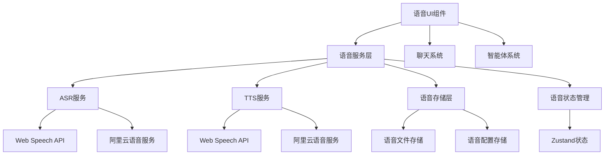

# 设计文档 - 语音功能重建

## 架构概览

### 整体架构图



## 核心组件

### 1. 语音服务层

**职责：** 封装语音识别和合成逻辑
**接口：**

- `recognizeSpeech(audio: Blob): Promise<string>`
- `synthesizeSpeech(text: string, options: TTSOptions): Promise<Blob>`
- `startRealTimeRecognition(): Promise<void>`
- `stopRealTimeRecognition(): Promise<string>`
  **依赖：** Web Speech API, 阿里云语音服务

### 2. 语音组件层

**职责：** 提供语音交互UI组件
**组件：**

- VoiceRecorder - 语音录制组件
- VoicePlayer - 语音播放组件
- VoiceSettings - 语音设置组件
  **依赖：** React, 语音服务层

### 3. 语音存储层

**职责：** 管理语音文件和配置
**功能：**

- 语音文件存储和检索
- 语音配置保存和加载
  **依赖：** 本地存储, 数据库

### 4. 语音状态管理

**职责：** 管理语音交互状态
**状态：**

- 录音状态
- 播放状态
- 识别状态
- 合成状态
  **依赖：** Zustand

## 接口设计

### API规范

#### 语音识别API：

- **端点：** `/api/voice/recognize`
- **请求格式：** `multipart/form-data`
- **响应格式：** `{ success: boolean, text: string, confidence: number }`

#### 语音合成API：

- **端点：** `/api/voice/synthesize`
- **请求格式：** `{ text: string, options: TTSOptions }`
- **响应格式：** `{ success: boolean, audioUrl: string }`

#### 语音配置API：

- **端点：** `/api/voice/config`
- **请求格式：** `{ voice: string, speed: number, volume: number }`
- **响应格式：** `{ success: boolean, config: VoiceConfig }`

### 错误处理

#### 错误类型：

- `VoiceRecognitionError` - 语音识别错误
- `VoiceSynthesisError` - 语音合成错误
- `VoiceConfigError` - 语音配置错误
- `VoiceStorageError` - 语音存储错误

#### 错误处理策略：

- 自动重试机制
- 降级到备用方案
- 用户友好的错误提示
- 错误日志记录

## 数据模型

### 实体设计

#### VoiceConfig：

```typescript
interface VoiceConfig {
  id: string;
  userId: string;
  asrProvider: 'web' | 'aliyun' | 'baidu';
  ttsProvider: 'web' | 'aliyun' | 'baidu';
  voice: string;
  speed: number;
  volume: number;
  language: string;
  createdAt: Date;
  updatedAt: Date;
}
```

#### TTSOptions：

```typescript
interface TTSOptions {
  voice?: string;
  speed?: number;
  volume?: number;
  language?: string;
  provider?: 'web' | 'aliyun' | 'baidu';
}
```

### 关系映射

- `VoiceConfig` 与 `User` 一对一关系

### 约束条件

- 语音文件大小限制：10MB
- 语音时长限制：5分钟
- 语音配置数量限制：每个用户最多5个
