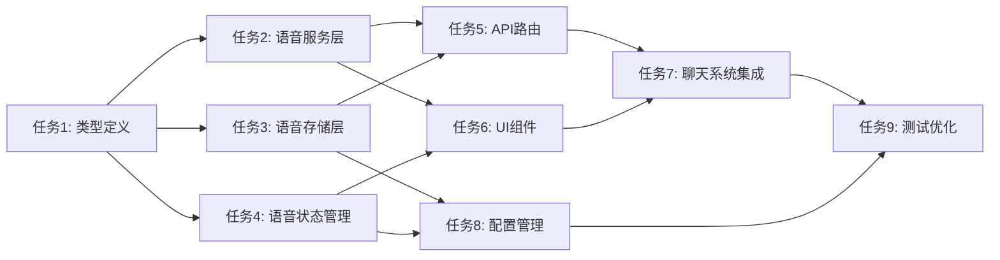

# 任务拆分文档 - 语音功能重建

## 任务列表

### 任务1：创建语音类型定义

#### 输入契约

- 前置依赖：无
- 输入数据：语音功能需求文档
- 环境依赖：TypeScript环境

#### 输出契约

- 输出数据：完整的语音类型定义
- 交付物：`types/voice/index.ts`
- 验收标准：类型定义完整，无TypeScript错误

#### 实现约束

- 技术栈：TypeScript
- 接口规范：符合项目类型定义规范
- 质量要求：类型安全，文档完整

### 任务2：实现语音服务层

#### 输入契约

- 前置依赖：语音类型定义
- 输入数据：语音服务需求
- 环境依赖：Web Speech API, 阿里云SDK

#### 输出契约

- 输出数据：语音识别和合成服务
- 交付物：`lib/voice/services/`
- 验收标准：服务功能完整，错误处理完善

#### 实现约束

- 技术栈：TypeScript, Web Speech API
- 接口规范：统一的语音服务接口
- 质量要求：高可用，低延迟

### 任务3：实现语音存储层

#### 输入契约

- 前置依赖：语音类型定义
- 输入数据：存储需求
- 环境依赖：数据库连接

#### 输出契约

- 输出数据：语音存储管理服务
- 交付物：`lib/voice/storage/`
- 验收标准：存储功能完整，数据一致性

#### 实现约束

- 技术栈：TypeScript, SQLite
- 接口规范：统一的存储接口
- 质量要求：数据安全，性能优化

### 任务4：实现语音状态管理

#### 输入契约

- 前置依赖：语音类型定义
- 输入数据：状态管理需求
- 环境依赖：Zustand

#### 输出契约

- 输出数据：语音状态管理store
- 交付物：`lib/voice/store/`
- 验收标准：状态管理完整，响应及时

#### 实现约束

- 技术栈：TypeScript, Zustand
- 接口规范：统一的状态管理接口
- 质量要求：状态同步，性能优化

### 任务5：实现语音API路由

#### 输入契约

- 前置依赖：语音服务层，语音存储层
- 输入数据：API需求
- 环境依赖：Next.js API

#### 输出契约

- 输出数据：语音API路由
- 交付物：`app/api/voice/`
- 验收标准：API功能完整，错误处理完善

#### 实现约束

- 技术栈：TypeScript, Next.js
- 接口规范：RESTful API
- 质量要求：高可用，安全可靠

### 任务6：实现语音UI组件

#### 输入契约

- 前置依赖：语音服务层，语音状态管理
- 输入数据：UI需求
- 环境依赖：React, Tailwind CSS

#### 输出契约

- 输出数据：语音交互组件
- 交付物：`components/voice/`
- 验收标准：组件功能完整，用户体验良好

#### 实现约束

- 技术栈：TypeScript, React, Tailwind CSS
- 接口规范：统一的组件接口
- 质量要求：响应式设计，无障碍访问

### 任务7：集成语音功能到聊天系统

#### 输入契约

- 前置依赖：所有语音功能模块
- 输入数据：聊天系统集成需求
- 环境依赖：聊天系统

#### 输出契约

- 输出数据：集成的语音聊天功能
- 交付物：更新的聊天组件
- 验收标准：语音功能与聊天系统无缝集成

#### 实现约束

- 技术栈：TypeScript, React
- 接口规范：与现有聊天系统兼容
- 质量要求：功能稳定，性能优化

### 任务8：实现语音配置管理

#### 输入契约

- 前置依赖：语音存储层，语音状态管理
- 输入数据：配置管理需求
- 环境依赖：配置系统

#### 输出契约

- 输出数据：语音配置管理功能
- 交付物：`components/voice/VoiceSettings.tsx`
- 验收标准：配置功能完整，用户友好

#### 实现约束

- 技术栈：TypeScript, React
- 接口规范：统一的配置接口
- 质量要求：配置持久化，实时生效

### 任务9：测试和优化语音功能

#### 输入契约

- 前置依赖：所有语音功能模块
- 输入数据：测试需求
- 环境依赖：测试环境

#### 输出契约

- 输出数据：测试报告和优化建议
- 交付物：测试用例，性能报告
- 验收标准：测试覆盖率 > 80%，性能达标

#### 实现约束

- 技术栈：Jest, Playwright
- 接口规范：统一的测试接口
- 质量要求：测试全面，性能优化

## 依赖关系图

