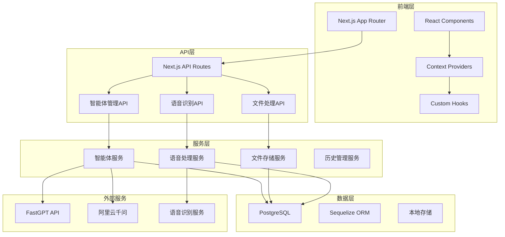

# 需求对齐文档 - 项目全局梳理分析

## 原始需求

用户要求对项目进行全局深度分析，梳理项目架构及功能需求，分析后续应该怎样整合。

## 项目上下文

### 技术栈

- **前端**: Next.js 15.2.4 (App Router) + React 18 + TypeScript 5
- **UI库**: shadcn/ui + Radix UI + Tailwind CSS + Lucide Icons
- **状态管理**: React Context API + Zustand
- **后端**: Next.js API Routes + Node.js
- **数据库**: PostgreSQL + Sequelize ORM
- **部署**: Docker + Docker Compose
- **测试**: Playwright + Jest
- **音频处理**: Web Audio API + MediaRecorder API
- **语音识别**: OpenAI Whisper兼容接口

### 现有架构理解

- **架构模式**: 前后端分离 + 微服务化API设计
- **核心模块**: 智能体管理、对话系统、文件处理、语音交互
- **集成点**: FastGPT API、阿里云千问、语音识别服务

## 需求理解

### 功能边界

**包含功能：**

- [x] 多智能体对话系统（FastGPT、CAD分析器、图像编辑器）
- [x] 用户端界面（无需登录，设备ID管理）
- [x] 管理员端界面（智能体配置、系统监控）
- [x] 语音输入输出功能（TTS/ASR）
- [x] 文件上传处理（图片、CAD图纸）
- [x] 对话历史管理（分页、搜索、标签）
- [x] 多语言支持（i18n）
- [x] 响应式设计（桌面/移动端）
- [x] 离线模式支持
- [x] 消息反馈系统（点赞/点踩）
- [x] 全局变量管理
- [x] 数据库迁移和初始化
- [x] 完整的测试覆盖（E2E、单元测试）

**明确不包含（Out of Scope）：**

- [ ] 用户注册登录系统（当前为设备ID管理）
- [ ] 支付和订阅功能
- [ ] 第三方社交登录
- [ ] 实时协作功能
- [ ] 移动端原生应用

## 项目架构深度分析

### 1. 整体架构图

### 2. 核心组件分析

#### 智能体系统
- **类型**: FastGPT、CAD分析器、图像编辑器
- **配置**: 数据库存储，支持动态配置
- **切换**: 实时切换，支持全局变量管理
- **状态**: Context管理，持久化存储

#### 对话系统
- **消息流**: 流式响应，支持中断
- **历史管理**: 分页加载，搜索过滤
- **文件支持**: 图片、CAD图纸上传
- **语音交互**: 录音、转文字、TTS播放

#### 文件处理
- **图片编辑**: 画笔工具、坐标标记
- **CAD分析**: 设备识别、报告生成
- **存储策略**: 本地存储 + 数据库记录

### 3. 数据流分析

## 疑问澄清

### P0级问题（必须澄清）

1. **智能体配置重复问题**
   - 背景：发现 `config/default-agents.ts` 和 `lib/agents/default-agents.ts` 存在重复配置
   - 影响：可能导致配置不一致，维护困难
   - 建议方案：统一配置源，删除重复文件

2. **API端点配置分散**
   - 背景：API端点配置分散在多个文件中
   - 影响：配置管理复杂，容易出错
   - 建议方案：集中化配置管理

3. **测试覆盖不完整**
   - 背景：部分核心功能缺少测试覆盖
   - 影响：代码质量无法保证
   - 建议方案：补充单元测试和集成测试

## 验收标准

### 功能验收

- [ ] 所有智能体类型正常工作
- [ ] 语音输入输出功能稳定
- [ ] 文件上传处理正确
- [ ] 对话历史管理完整
- [ ] 管理员功能正常
- [ ] 多语言切换正常
- [ ] 响应式设计适配良好

### 质量验收

- [ ] 单元测试覆盖率 > 80%
- [ ] E2E测试覆盖核心流程
- [ ] 代码规范检查通过
- [ ] 性能基准：页面加载 < 3s
- [ ] 安全扫描无高危漏洞

### 架构验收

- [ ] 配置管理统一化
- [ ] 代码重复消除
- [ ] 错误处理完善
- [ ] 日志记录完整
- [ ] 监控指标健全
