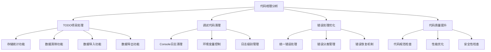
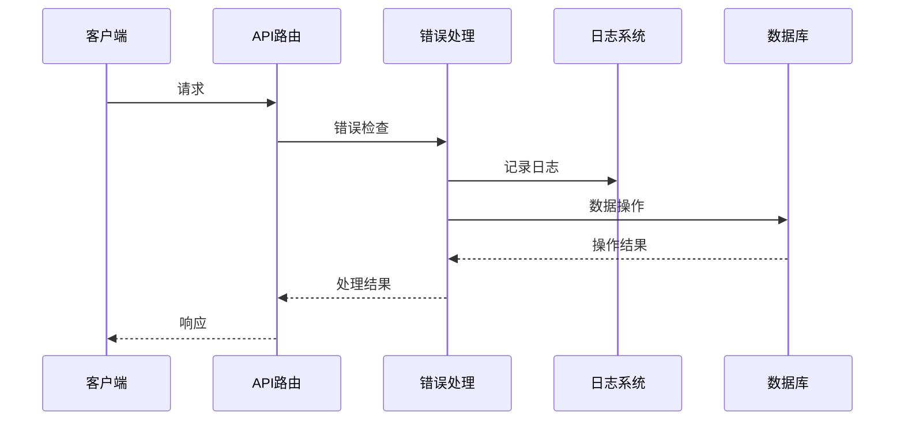

# 设计文档 - 全局代码梳理分析

## 架构概览

### 整体架构图



## 核心组件

### 1. TODO项目处理模块

#### 组件职责

- 实现自研智能体存储统计功能
- 实现数据清除、导入、导出功能
- 提供完整的CRUD操作

#### 接口设计

```typescript
interface CustomAgentStorageStats {
  totalSizeMB: number;
  maxSizeMB: number;
  usagePercent: number;
  chatCount: number;
}

interface CustomAgentData {
  id: string;
  name: string;
  config: any;
  createdAt: Date;
  updatedAt: Date;
}

// 存储统计接口
export function getCustomAgentStorageStats(): Promise<CustomAgentStorageStats>;

// 数据清除接口
export function clearAllCustomAgentData(): Promise<boolean>;

// 数据导出接口
export function exportAllCustomAgentData(): Promise<CustomAgentData[]>;

// 数据导入接口
export function importCustomAgentData(
  data: CustomAgentData[]
): Promise<boolean>;
```

#### 依赖关系

- 数据库连接模块
- 文件系统操作模块
- 数据验证模块

### 2. 调试代码清理模块

#### 组件职责

- 识别和清理开发调试代码
- 保留生产环境必要日志
- 提供日志级别控制

#### 接口设计

```typescript
interface LoggerConfig {
  level: 'debug' | 'info' | 'warn' | 'error';
  enableConsole: boolean;
  enableFile: boolean;
  enableRemote: boolean;
}

class Logger {
  static debug(message: string, ...args: any[]): void;
  static info(message: string, ...args: any[]): void;
  static warn(message: string, ...args: any[]): void;
  static error(message: string, ...args: any[]): void;
}
```

#### 依赖关系

- 环境配置模块
- 日志存储模块

### 3. 错误处理优化模块

#### 组件职责

- 统一错误处理模式
- 提供错误分类和恢复机制
- 标准化错误响应格式

#### 接口设计

```typescript
interface ErrorResponse {
  success: false;
  error: {
    code: string;
    message: string;
    details?: any;
    timestamp: string;
    requestId: string;
  };
}

interface ErrorHandler {
  handle(error: Error, context: any): ErrorResponse;
  classify(error: Error): string;
  recover(error: Error): boolean;
}
```

#### 依赖关系

- 错误分类模块
- 错误恢复模块
- 响应格式化模块

## 数据流向图



## 异常处理策略

### 1. 错误分类

- **系统错误**：数据库连接、文件系统等
- **业务错误**：数据验证、权限检查等
- **网络错误**：API调用、网络超时等
- **用户错误**：输入验证、操作限制等

### 2. 错误恢复

- **自动重试**：网络错误、临时故障
- **降级处理**：功能不可用时的备选方案
- **用户提示**：需要用户干预的错误

### 3. 错误记录

- **错误日志**：记录详细错误信息
- **性能监控**：记录错误频率和影响
- **告警机制**：关键错误实时通知

## 实现约束

### 技术约束

- 使用TypeScript严格模式
- 遵循项目代码规范
- 保持API兼容性
- 确保测试覆盖率

### 性能约束

- 错误处理延迟 < 100ms
- 日志记录延迟 < 50ms
- 内存使用增长 < 10%

### 安全约束

- 敏感信息不记录到日志
- 错误信息不泄露系统细节
- 实现访问控制和权限管理
