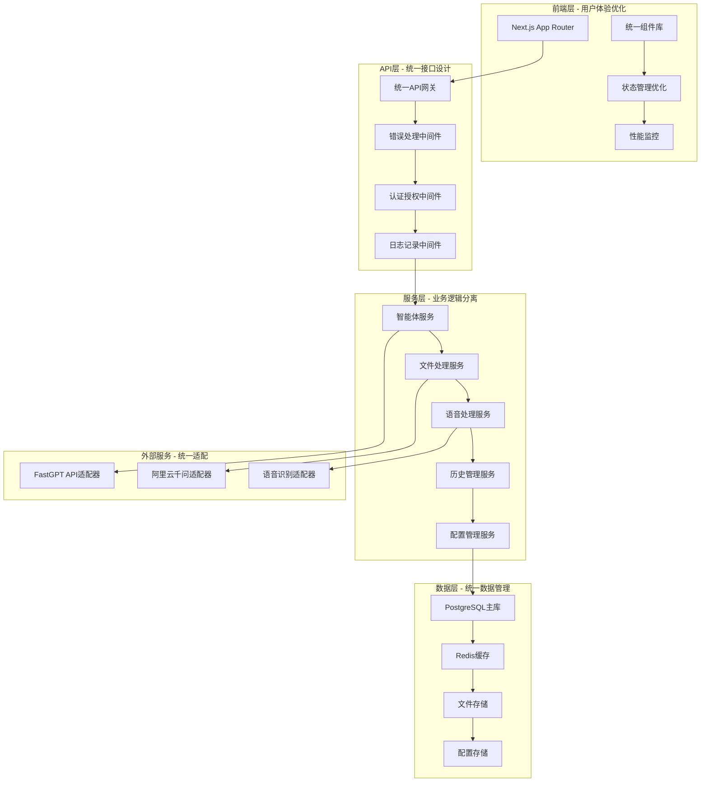
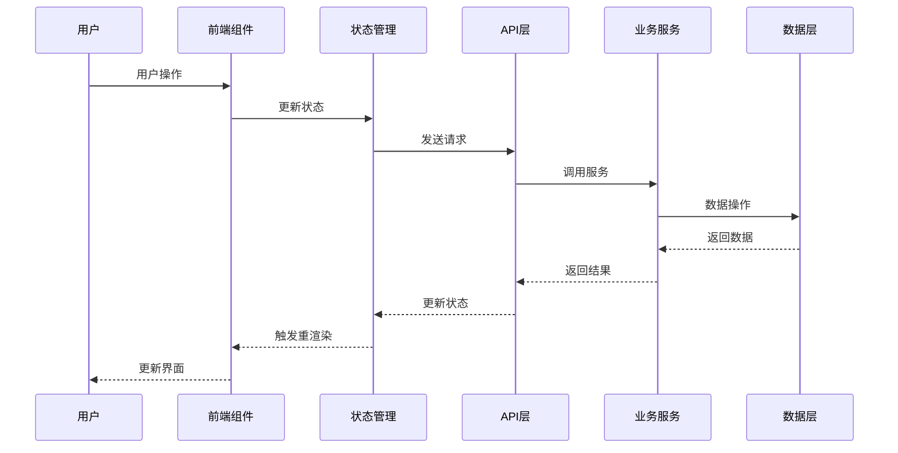

# 设计文档 - 项目全局梳理分析

## 架构概览

### 整体架构图



## 核心组件

### 1. 统一配置管理架构

#### 配置中心设计

```typescript
// lib/config/index.ts
export interface ConfigManager {
  get<T>(key: string): T;
  set<T>(key: string, value: T): void;
  watch(key: string, callback: (value: any) => void): void;
  validate(): boolean;
}

// 统一配置结构
export interface UnifiedConfig {
  agents: AgentConfig[];
  api: ApiConfig;
  database: DatabaseConfig;
  storage: StorageConfig;
  features: FeatureConfig;
}
```

#### 配置管理优势

- **单一数据源**：消除重复配置
- **环境隔离**：开发/测试/生产环境分离
- **动态更新**：支持运行时配置更新
- **类型安全**：TypeScript类型检查

### 2. 全局错误处理架构

#### 错误处理中间件

```typescript
// lib/middleware/error-handler.ts
export class GlobalErrorHandler {
  static handle(error: Error, context: ErrorContext): ErrorResponse {
    // 统一错误分类
    // 统一错误格式
    // 统一日志记录
    // 统一监控上报
  }
}

// 统一错误响应格式
export interface ErrorResponse {
  success: false;
  error: {
    code: string;
    message: string;
    details?: any;
    timestamp: string;
    requestId: string;
  };
}
```

#### 错误处理优势

- **统一格式**：所有API返回统一错误格式
- **分类处理**：业务错误、系统错误、网络错误分类
- **监控集成**：自动上报错误到监控系统
- **用户友好**：错误信息对用户友好

### 3. 组件复用架构

#### 共享组件库设计

```typescript
// components/shared/
├── forms/           # 表单组件
├── data-display/    # 数据展示组件
├── feedback/        # 反馈组件
├── navigation/      # 导航组件
└── layout/          # 布局组件

// 组件接口规范
export interface ComponentProps {
  className?: string
  children?: React.ReactNode
  variant?: 'default' | 'primary' | 'secondary'
  size?: 'sm' | 'md' | 'lg'
  disabled?: boolean
  loading?: boolean
}
```

#### 组件复用优势

- **DRY原则**：消除重复代码
- **一致性**：UI/UX保持一致
- **可维护性**：统一修改，全局生效
- **可测试性**：组件独立测试

### 4. 状态管理优化

#### 状态管理架构

```typescript
// context/unified-state.tsx
export interface AppState {
  agents: AgentState;
  chat: ChatState;
  ui: UIState;
  config: ConfigState;
}

// 状态更新机制
export interface StateManager {
  getState<T>(selector: (state: AppState) => T): T;
  setState(updater: (state: AppState) => AppState): void;
  subscribe(
    selector: (state: AppState) => any,
    callback: (value: any) => void
  ): () => void;
}
```

#### 状态管理优势

- **性能优化**：按需更新，避免不必要的重渲染
- **状态同步**：多组件状态自动同步
- **调试友好**：状态变化可追踪
- **类型安全**：TypeScript类型检查

### 5. API设计统一规范

#### API响应格式

```typescript
// 成功响应
export interface SuccessResponse<T = any> {
  success: true;
  data: T;
  meta?: {
    pagination?: PaginationMeta;
    timestamp: string;
    requestId: string;
  };
}

// 分页响应
export interface PaginationMeta {
  page: number;
  limit: number;
  total: number;
  totalPages: number;
}
```

#### API设计优势

- **一致性**：所有API返回格式一致
- **可预测性**：客户端可以预测响应结构
- **可扩展性**：支持元数据扩展
- **向后兼容**：版本升级保持兼容

## 接口设计

### API规范

#### 智能体管理API

```typescript
// GET /api/agents
// 获取智能体列表
export interface GetAgentsResponse extends SuccessResponse<Agent[]> {}

// POST /api/agents
// 创建智能体
export interface CreateAgentRequest {
  name: string;
  type: AgentType;
  config: AgentConfig;
}

// PUT /api/agents/:id
// 更新智能体
export interface UpdateAgentRequest extends Partial<CreateAgentRequest> {}
```

#### 对话API

```typescript
// POST /api/chat
// 发送消息
export interface SendMessageRequest {
  message: string;
  agentId: string;
  conversationId?: string;
  files?: File[];
}

// GET /api/chat/history
// 获取对话历史
export interface GetHistoryRequest {
  agentId: string;
  page?: number;
  limit?: number;
  search?: string;
}
```

### 数据模型

#### 实体设计

```typescript
// 智能体实体
export interface Agent {
  id: string;
  name: string;
  type: AgentType;
  config: AgentConfig;
  isPublished: boolean;
  createdAt: Date;
  updatedAt: Date;
}

// 消息实体
export interface Message {
  id: string;
  role: 'user' | 'assistant';
  content: string;
  agentId: string;
  conversationId: string;
  metadata?: MessageMetadata;
  createdAt: Date;
}

// 对话实体
export interface Conversation {
  id: string;
  agentId: string;
  title: string;
  messages: Message[];
  createdAt: Date;
  updatedAt: Date;
}
```

## 数据流向图



## 异常处理策略

### 错误分类

1. **业务错误**：用户输入错误、业务规则违反
2. **系统错误**：服务器内部错误、数据库错误
3. **网络错误**：网络超时、连接失败
4. **认证错误**：权限不足、认证失败

### 错误处理流程

1. **捕获错误**：在适当的层级捕获错误
2. **分类处理**：根据错误类型选择处理策略
3. **记录日志**：记录错误详情用于调试
4. **用户反馈**：向用户显示友好的错误信息
5. **监控上报**：上报错误到监控系统

### 重试机制

```typescript
// 指数退避重试
export async function retryWithBackoff<T>(
  fn: () => Promise<T>,
  maxRetries: number = 3,
  baseDelay: number = 1000
): Promise<T> {
  for (let i = 0; i < maxRetries; i++) {
    try {
      return await fn();
    } catch (error) {
      if (i === maxRetries - 1) throw error;
      await new Promise(resolve =>
        setTimeout(resolve, baseDelay * Math.pow(2, i))
      );
    }
  }
}
```

## 性能优化方案

### 前端性能优化

1. **代码分割**：按路由和功能分割代码
2. **懒加载**：组件和资源懒加载
3. **缓存策略**：合理使用浏览器缓存
4. **虚拟化**：长列表虚拟化渲染

### 后端性能优化

1. **数据库优化**：索引优化、查询优化
2. **缓存策略**：Redis缓存热点数据
3. **连接池**：数据库连接池管理
4. **异步处理**：耗时操作异步处理

### 监控指标

1. **响应时间**：API响应时间监控
2. **错误率**：错误率统计和告警
3. **吞吐量**：系统吞吐量监控
4. **资源使用**：CPU、内存、磁盘使用率

## 安全策略

### 输入验证

1. **参数验证**：所有输入参数验证
2. **SQL注入防护**：使用参数化查询
3. **XSS防护**：输出编码和CSP策略
4. **CSRF防护**：CSRF令牌验证

### 认证授权

1. **JWT令牌**：无状态认证
2. **权限控制**：基于角色的访问控制
3. **会话管理**：安全的会话管理
4. **密码安全**：密码加密存储

### 数据保护

1. **敏感数据加密**：API密钥等敏感数据加密
2. **传输加密**：HTTPS传输
3. **存储加密**：数据库敏感字段加密
4. **日志脱敏**：日志中敏感信息脱敏
