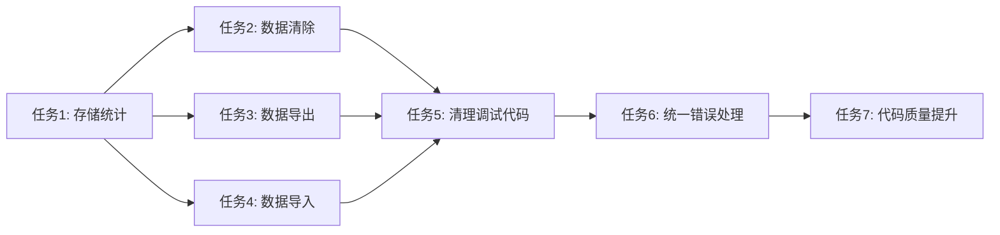

# 任务拆分文档 - 全局代码梳理分析

## 任务列表

### 任务1：实现自研智能体存储统计功能
#### 输入契约
- 前置依赖：数据库连接模块、文件系统模块
- 输入数据：无
- 环境依赖：PostgreSQL数据库、Redis缓存

#### 输出契约
- 输出数据：StorageStats对象
- 交付物：完整的存储统计功能
- 验收标准：能正确计算存储使用情况，包含总大小、最大大小、使用百分比、聊天数量

#### 实现约束
- 技术栈：TypeScript, PostgreSQL, Redis
- 接口规范：遵循现有API设计规范
- 质量要求：单元测试覆盖率 > 80%

#### 依赖关系
- 后置任务：任务2、任务3、任务4
- 并行任务：无

### 任务2：实现自研智能体数据清除功能
#### 输入契约
- 前置依赖：任务1完成
- 输入数据：无
- 环境依赖：数据库连接、文件系统权限

#### 输出契约
- 输出数据：boolean操作结果
- 交付物：数据清除功能
- 验收标准：能安全清除所有自研智能体数据，返回操作结果

#### 实现约束
- 技术栈：TypeScript, PostgreSQL
- 接口规范：遵循现有API设计规范
- 质量要求：包含数据备份和恢复机制

#### 依赖关系
- 前置任务：任务1
- 后置任务：任务5
- 并行任务：无

### 任务3：实现自研智能体数据导出功能
#### 输入契约
- 前置依赖：任务1完成
- 输入数据：无
- 环境依赖：数据库连接、文件系统写入权限

#### 输出契约
- 输出数据：CustomAgentData[]数组
- 交付物：数据导出功能
- 验收标准：能导出所有自研智能体数据为JSON格式

#### 实现约束
- 技术栈：TypeScript, PostgreSQL
- 接口规范：遵循现有API设计规范
- 质量要求：包含数据完整性验证

#### 依赖关系
- 前置任务：任务1
- 后置任务：任务5
- 并行任务：无

### 任务4：实现自研智能体数据导入功能
#### 输入契约
- 前置依赖：任务1完成
- 输入数据：CustomAgentData[]数组
- 环境依赖：数据库连接、文件系统读取权限

#### 输出契约
- 输出数据：boolean操作结果
- 交付物：数据导入功能
- 验收标准：能导入自研智能体数据，包含数据验证和错误处理

#### 实现约束
- 技术栈：TypeScript, PostgreSQL
- 接口规范：遵循现有API设计规范
- 质量要求：包含数据格式验证和重复检查

#### 依赖关系
- 前置任务：任务1
- 后置任务：任务5
- 并行任务：无

### 任务5：清理Console调试代码
#### 输入契约
- 前置依赖：任务2、3、4完成
- 输入数据：项目代码文件
- 环境依赖：代码分析工具

#### 输出契约
- 输出数据：清理后的代码文件
- 交付物：调试代码清理功能
- 验收标准：移除开发调试代码，保留生产环境必要日志

#### 实现约束
- 技术栈：TypeScript, 代码分析工具
- 接口规范：保持现有日志接口
- 质量要求：不影响现有功能

#### 依赖关系
- 前置任务：任务2、3、4
- 后置任务：任务6
- 并行任务：无

### 任务6：统一错误处理模式
#### 输入契约
- 前置依赖：任务5完成
- 输入数据：现有错误处理代码
- 环境依赖：错误处理中间件

#### 输出契约
- 输出数据：统一错误处理系统
- 交付物：错误处理优化功能
- 验收标准：统一错误响应格式，提升用户体验

#### 实现约束
- 技术栈：TypeScript, Express中间件
- 接口规范：遵循RESTful API规范
- 质量要求：包含错误分类和恢复机制

#### 依赖关系
- 前置任务：任务5
- 后置任务：任务7
- 并行任务：无

### 任务7：代码质量提升
#### 输入契约
- 前置依赖：任务6完成
- 输入数据：项目代码
- 环境依赖：代码质量检查工具

#### 输出契约
- 输出数据：优化后的代码
- 交付物：代码质量提升功能
- 验收标准：代码规范一致性 > 95%，测试覆盖率 > 80%

#### 实现约束
- 技术栈：TypeScript, ESLint, Prettier
- 接口规范：遵循项目代码规范
- 质量要求：包含性能优化和安全性检查

#### 依赖关系
- 前置任务：任务6
- 后置任务：无
- 并行任务：无

## 依赖关系图

## 执行时间估算

- 任务1：2小时
- 任务2：1.5小时
- 任务3：1.5小时
- 任务4：2小时
- 任务5：3小时
- 任务6：4小时
- 任务7：3小时

**总预估时间：17小时**

## 风险控制

### 高风险任务
- 任务2（数据清除）：可能造成数据丢失
- 任务6（错误处理）：可能影响现有功能

### 风险缓解
- 数据清除前进行备份
- 错误处理变更前进行充分测试
- 每个任务完成后进行验证测试

