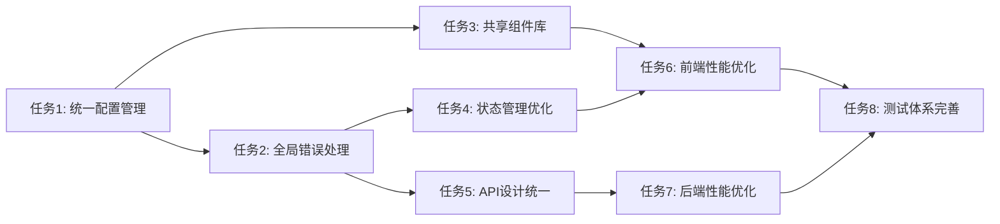

# 任务拆分文档 - 项目全局梳理分析

## 任务列表

### 任务1：统一配置管理系统重构

#### 输入契约

- 前置依赖：现有配置分析完成
- 输入数据：当前分散的配置文件
- 环境依赖：TypeScript、Node.js环境

#### 输出契约

- 输出数据：统一的配置管理系统
- 交付物：
  - `lib/config/index.ts` - 配置管理器
  - `lib/config/types.ts` - 配置类型定义
  - `lib/config/validators.ts` - 配置验证器
  - `lib/config/loaders.ts` - 配置加载器
- 验收标准：
  - 所有配置统一管理
  - 支持环境变量覆盖
  - 类型安全验证通过
  - 配置热更新功能正常

#### 实现约束

- 技术栈：TypeScript、Zod验证
- 接口规范：统一配置接口
- 质量要求：100%类型覆盖，无any类型

#### 依赖关系

- 后置任务：任务2、任务3
- 并行任务：无

### 任务2：全局错误处理架构实现

#### 输入契约

- 前置依赖：任务1完成
- 输入数据：现有错误处理代码
- 环境依赖：Next.js API Routes

#### 输出契约

- 输出数据：统一的错误处理系统
- 交付物：
  - `lib/middleware/error-handler.ts` - 错误处理中间件
  - `lib/middleware/error-types.ts` - 错误类型定义
  - `lib/middleware/error-logger.ts` - 错误日志记录
  - `lib/middleware/error-monitor.ts` - 错误监控
- 验收标准：
  - 所有API返回统一错误格式
  - 错误分类处理正确
  - 错误日志记录完整
  - 监控集成正常

#### 实现约束

- 技术栈：TypeScript、Next.js中间件
- 接口规范：统一错误响应格式
- 质量要求：错误处理覆盖率100%

#### 依赖关系

- 前置任务：任务1
- 后置任务：任务4、任务5
- 并行任务：任务3

### 任务3：共享组件库重构

#### 输入契约

- 前置依赖：现有组件分析完成
- 输入数据：重复的组件代码
- 环境依赖：React、TypeScript、Tailwind CSS

#### 输出契约

- 输出数据：统一的共享组件库
- 交付物：
  - `components/shared/` - 共享组件目录
  - `components/shared/types.ts` - 组件类型定义
  - `components/shared/index.ts` - 组件导出
  - `components/shared/README.md` - 组件文档
- 验收标准：
  - 重复组件代码消除
  - 组件接口统一
  - 组件文档完整
  - 组件测试覆盖

#### 实现约束

- 技术栈：React、TypeScript、shadcn/ui
- 接口规范：统一组件Props接口
- 质量要求：组件复用率>80%

#### 依赖关系

- 前置任务：无
- 后置任务：任务6
- 并行任务：任务2

### 任务4：状态管理优化

#### 输入契约

- 前置依赖：任务1、任务2完成
- 输入数据：现有Context状态管理
- 环境依赖：React Context API、Zustand

#### 输出契约

- 输出数据：优化的状态管理系统
- 交付物：
  - `context/unified-state.tsx` - 统一状态管理
  - `hooks/useAppState.ts` - 状态Hook
  - `hooks/useAppDispatch.ts` - 状态更新Hook
  - `lib/state/selectors.ts` - 状态选择器
- 验收标准：
  - 状态更新性能优化
  - 状态同步正确
  - 状态调试友好
  - 类型安全保证

#### 实现约束

- 技术栈：React Context、Zustand
- 接口规范：统一状态接口
- 质量要求：状态更新性能提升50%

#### 依赖关系

- 前置任务：任务1、任务2
- 后置任务：任务6
- 并行任务：任务5

### 任务5：API设计统一规范

#### 输入契约

- 前置依赖：任务1、任务2完成
- 输入数据：现有API接口
- 环境依赖：Next.js API Routes、TypeScript

#### 输出契约

- 输出数据：统一的API设计规范
- 交付物：
  - `lib/api/types.ts` - API类型定义
  - `lib/api/response.ts` - 统一响应格式
  - `lib/api/validators.ts` - 请求验证器
  - `lib/api/middleware.ts` - API中间件
- 验收标准：
  - 所有API响应格式统一
  - 请求验证完整
  - 错误处理统一
  - API文档完整

#### 实现约束

- 技术栈：Next.js、TypeScript、Zod
- 接口规范：RESTful API设计
- 质量要求：API一致性100%

#### 依赖关系

- 前置任务：任务1、任务2
- 后置任务：任务7
- 并行任务：任务4

### 任务6：前端性能优化

#### 输入契约

- 前置依赖：任务3、任务4完成
- 输入数据：现有前端代码
- 环境依赖：Next.js、React、TypeScript

#### 输出契约

- 输出数据：性能优化的前端应用
- 交付物：
  - 代码分割配置
  - 懒加载组件
  - 缓存策略配置
  - 性能监控工具
- 验收标准：
  - 首屏加载时间<3s
  - 页面切换<1s
  - 内存使用优化
  - 包体积减少30%

#### 实现约束

- 技术栈：Next.js、React、Webpack
- 接口规范：保持现有接口不变
- 质量要求：性能指标达标

#### 依赖关系

- 前置任务：任务3、任务4
- 后置任务：任务8
- 并行任务：任务7

### 任务7：后端性能优化

#### 输入契约

- 前置依赖：任务5完成
- 输入数据：现有后端代码
- 环境依赖：Node.js、PostgreSQL、Redis

#### 输出契约

- 输出数据：性能优化的后端服务
- 交付物：
  - 数据库优化配置
  - Redis缓存策略
  - 连接池配置
  - 异步处理队列
- 验收标准：
  - API响应时间<500ms
  - 数据库查询优化
  - 缓存命中率>80%
  - 并发处理能力提升

#### 实现约束

- 技术栈：Node.js、PostgreSQL、Redis
- 接口规范：保持现有API不变
- 质量要求：性能指标达标

#### 依赖关系

- 前置任务：任务5
- 后置任务：任务8
- 并行任务：任务6

### 任务8：测试体系完善

#### 输入契约

- 前置依赖：任务6、任务7完成
- 输入数据：现有测试代码
- 环境依赖：Jest、Playwright、Testing Library

#### 输出契约

- 输出数据：完整的测试体系
- 交付物：
  - 单元测试补充
  - 集成测试完善
  - E2E测试覆盖
  - 测试工具配置
- 验收标准：
  - 单元测试覆盖率>80%
  - 集成测试覆盖核心流程
  - E2E测试覆盖用户场景
  - 测试自动化运行

#### 实现约束

- 技术栈：Jest、Playwright、Testing Library
- 接口规范：测试接口统一
- 质量要求：测试覆盖率达标

#### 依赖关系

- 前置任务：任务6、任务7
- 后置任务：无
- 并行任务：无

## 依赖关系图

## 实施优先级

### 高优先级（P0）

1. **任务1：统一配置管理系统重构**
   - 影响范围：全项目
   - 风险等级：高
   - 实施难度：中

2. **任务2：全局错误处理架构实现**
   - 影响范围：全项目
   - 风险等级：高
   - 实施难度：中

### 中优先级（P1）

3. **任务3：共享组件库重构**
   - 影响范围：前端
   - 风险等级：中
   - 实施难度：中

4. **任务4：状态管理优化**
   - 影响范围：前端
   - 风险等级：中
   - 实施难度：高

5. **任务5：API设计统一规范**
   - 影响范围：后端
   - 风险等级：中
   - 实施难度：中

### 低优先级（P2）

6. **任务6：前端性能优化**
   - 影响范围：前端
   - 风险等级：低
   - 实施难度：中

7. **任务7：后端性能优化**
   - 影响范围：后端
   - 风险等级：低
   - 实施难度：高

8. **任务8：测试体系完善**
   - 影响范围：全项目
   - 风险等级：低
   - 实施难度：中

## 风险评估

### 技术风险

- **配置管理重构**：可能影响现有功能
- **状态管理优化**：可能引入新的bug
- **API统一**：可能破坏现有接口

### 缓解措施

- **分阶段实施**：逐步替换，保持向后兼容
- **充分测试**：每个阶段都要充分测试
- **回滚方案**：准备回滚方案应对问题
- **监控告警**：实时监控系统状态

## 质量保证

### 代码质量

- **代码审查**：所有代码必须经过审查
- **类型检查**：TypeScript严格模式
- **代码规范**：ESLint + Prettier
- **文档更新**：代码变更同步更新文档

### 测试质量

- **单元测试**：核心逻辑100%覆盖
- **集成测试**：关键流程覆盖
- **E2E测试**：用户场景覆盖
- **性能测试**：性能指标验证

### 部署质量

- **灰度发布**：分批次发布
- **监控告警**：实时监控系统状态
- **回滚机制**：快速回滚能力
- **数据备份**：重要数据备份
