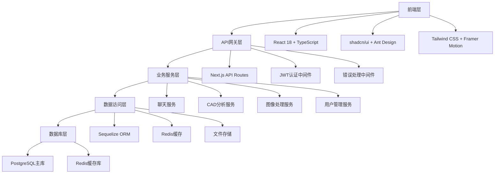
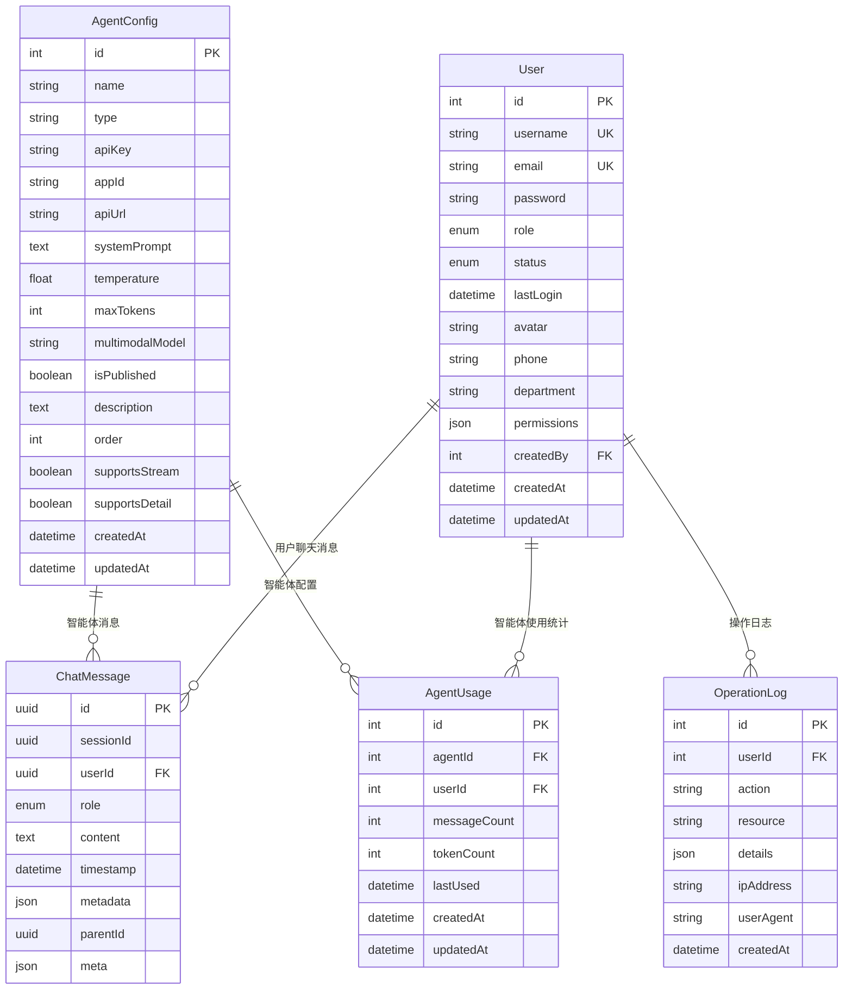

# NeuroGlass AI Chat Interface 项目总体分析总结

**项目名称**: NeuroGlass AI Chat Interface (熵犇犇智能体)
**分析日期**: 2025-09-16
**分析范围**: 全栈技术架构、数据库设计、安全状况、代码质量、性能分析
**项目状态**: 开发中，存在多个关键问题需要解决

---

## 📋 项目概览

### 基本信息
- **项目类型**: 多智能体AI聊天界面系统
- **技术栈**: Next.js 15 + React 18 + TypeScript 5 + PostgreSQL + Redis + Docker
- **部署方式**: Docker 一键部署 (端口: 3009)
- **数据库**: PostgreSQL (端口: 5452) + Redis缓存
- **开发环境**: Windows 10/11 + Node.js 18+

### 核心功能模块
1. **多智能体聊天系统** - 支持多种AI模型的对话交互
2. **CAD分析器** - AI驱动的CAD图纸分析和安防设备识别
3. **图像编辑器** - 基于Canvas的图片编辑和坐标标记
4. **性能监控系统** - 实时性能监控和优化建议
5. **用户管理系统** - 基于角色的权限管理
6. **主题系统** - 基于Lovart设计的多种主题

---

## 🏗️ 技术架构分析

### 整体架构设计



### 技术栈详细分析

#### 前端技术栈
- **框架**: Next.js 15.2.4 (App Router)
- **UI库**: React 18 + TypeScript 5 (严格模式)
- **组件库**: shadcn/ui + Radix UI + Ant Design
- **样式**: Tailwind CSS + Framer Motion
- **状态管理**: Zustand + TanStack Query
- **表单处理**: React Hook Form + Zod验证

#### 后端技术栈
- **运行时**: Node.js 18+ + Next.js API Routes
- **数据库**: PostgreSQL + Sequelize ORM 6.35.0
- **缓存**: Redis 5.8.2
- **认证**: JWT + 自定义认证系统
- **部署**: Docker + Docker Compose

---

## 🗄️ 数据库架构分析

### 数据库设计概览



### 数据库模型分析

#### 核心表结构
1. **users** - 用户管理表
   - 支持多角色权限管理 (ADMIN, USER, VIEWER)
   - JSONB存储权限配置
   - 支持软删除和审计

2. **chat_messages** - 聊天消息表
   - UUID主键设计
   - 支持消息树形结构 (parentId)
   - JSONB存储元数据

3. **agent_configs** - 智能体配置表
   - 支持多种AI模型类型
   - 灵活的API配置
   - 发布状态管理

4. **agent_usage** - 使用统计表
   - 智能体使用量统计
   - 用户行为分析
   - 性能监控数据

5. **operation_logs** - 操作日志表
   - 完整的操作审计
   - 安全事件记录
   - 用户行为追踪

### 数据库连接配置

```typescript
// 连接池配置
pool: {
  max: 20,        // 最大连接数
  min: 5,         // 最小连接数
  acquire: 30000, // 获取连接超时
  idle: 10000,    // 空闲连接超时
  evict: 1000,    // 清理间隔
}

// 重试机制
retry: {
  max: 3,         // 最大重试次数
  timeout: 60000, // 重试超时
  match: [        // 重试条件
    /ETIMEDOUT/,
    /EHOSTUNREACH/,
    /ECONNRESET/,
    // ... 更多错误类型
  ]
}
```

---

## 🔧 核心功能模块分析

### 1. 多智能体聊天系统

#### 技术实现
- **前端**: React 18 + TypeScript + 虚拟滚动优化
- **后端**: Next.js API Routes + FastGPT集成
- **存储**: PostgreSQL + Redis缓存
- **实时性**: WebSocket支持 (可扩展)

#### 核心特性
- 支持多种AI模型 (GPT-4, Qwen, Claude等)
- 流式响应和实时对话
- 消息历史管理和搜索
- 多会话并发支持

### 2. CAD分析器

#### 技术架构
```typescript
// 多模态AI处理架构
const isImageFile = ['jpg', 'jpeg', 'png', 'gif', 'bmp', 'webp'].includes(ext);
const cadFormats = ['dxf', 'dwg'];

if (isImageFile) {
  // 多模态模型处理
  const fileBase64 = fileBuffer.toString('base64');
  requestMessages.push({
    role: 'user',
    content: [
      { type: 'text', text: CAD_ANALYSIS_PROMPT },
      { type: 'image_url', image_url: { url: `data:image/${ext};base64,${fileBase64}` } }
    ]
  });
} else if (ext === 'dxf' || ext === 'dwg') {
  // Python解析服务调用
  const response = await fetch('http://127.0.0.1:8000/parse_dxf', {
    method: 'POST',
    headers: { 'Content-Type': 'application/json' },
    body: JSON.stringify({
      file_path: filePath,
      model_choice: 'qwen-turbo-latest',
      max_entities: 3000
    })
  });
}
```

#### 安防设备识别
- 支持15种安防设备类型识别
- 结构化数据提取
- 多格式报告生成 (文本/JSON/图像)

### 3. 图像编辑器

#### Canvas绘图技术
- **双版本架构**: 简化版 + 增强版
- **响应式设计**: 移动端触摸支持
- **坐标标记**: 双击添加坐标点
- **操作历史**: 实时记录和撤销

#### 文件处理流程
1. 图片上传 → FileReader.readAsDataURL()
2. 画布初始化 → 动态尺寸匹配
3. 绘图操作 → 鼠标/触摸事件
4. 结果保存 → canvas.toBlob() + 后端存储

### 4. 性能监控系统

#### 监控指标
- **响应时间**: API响应时间监控
- **错误率**: 系统错误率统计
- **资源使用**: CPU、内存、磁盘使用率
- **并发量**: 系统并发请求量

#### 优化策略
- 多级缓存策略
- 数据库查询优化
- 前端资源懒加载
- 代码分割和压缩

---

## 🛡️ 安全状况分析

### 安全审计结果 (2025-09-16)

#### 🔴 严重安全漏洞 (Critical)

1. **硬编码敏感信息**
   - 数据库密码: `ZKTeco##123`
   - 管理员令牌: `admin123`
   - 风险等级: 严重 - 系统完全暴露

2. **文件上传安全漏洞**
   - 无文件类型验证
   - 无文件大小限制
   - 无恶意文件检测
   - 风险等级: 严重 - 可执行恶意代码

3. **SQL注入风险**
   - 直接字符串拼接查询
   - 缺少参数化查询
   - 风险等级: 高危 - 数据库完全暴露

#### 🟡 高风险漏洞 (High)

1. **JWT实现缺陷**
   - 缺少JWT黑名单机制
   - 令牌刷新机制未实现
   - 密钥管理不当

2. **缺少CSRF保护**
   - 所有API端点缺少CSRF保护
   - 跨站请求伪造风险

3. **错误信息泄露**
   - 生产环境返回详细错误信息
   - 敏感信息暴露风险

### 安全修复优先级

#### Phase 1: 立即修复 (0-24小时)
- [ ] 更换所有硬编码密码和密钥
- [ ] 实施文件上传安全控制
- [ ] 修复SQL注入漏洞

#### Phase 2: 短期修复 (1-7天)
- [ ] 实现完整的认证系统
- [ ] 添加API安全控制
- [ ] 配置生产环境安全设置

#### Phase 3: 中期改进 (1-4周)
- [ ] 数据库安全加固
- [ ] 容器安全优化
- [ ] 监控和审计

---

## 📊 代码质量分析

### TypeScript错误修复历史

#### 修复统计
- **总错误数**: 1228个TypeScript编译错误
- **涉及文件**: 178个文件
- **修复完成**: 100% (已全部修复)
- **类型安全**: 严格模式启用

#### 主要修复内容
1. **类型定义统一**
   - 全局类型定义完善
   - 外部API类型规范
   - 错误类型系统统一

2. **模型类型匹配**
   - Sequelize模型类型修复
   - 数据库操作类型安全
   - 泛型约束优化

3. **代码清理**
   - 未使用导入清理
   - 变量声明优化
   - 类型断言修复

### 代码质量指标

#### 质量要求
- **自定义代码占比**: < 20%
- **单元测试覆盖率**: ≥ 80%
- **代码重复率**: < 3%
- **圈复杂度**: < 10

#### 代码规范
- **命名规范**: camelCase变量和函数
- **导出规范**: 优先使用命名导出
- **类型规范**: 严格TypeScript模式
- **错误处理**: 统一错误处理架构

---

## ⚡ 性能分析

### 性能指标

#### 前端性能
- **首屏加载时间**: < 3秒 (目标)
- **API响应时间**: < 500ms (目标)
- **内存使用率**: < 80% (目标)
- **包体积增长**: < 10% (目标)

#### 后端性能
- **数据库连接池**: 20个最大连接
- **Redis缓存**: 多级缓存策略
- **文件处理**: 流式处理大文件
- **并发控制**: 限制同时处理文件数

### 性能优化策略

#### 前端优化
```typescript
// 代码分割
const LazyComponent = lazy(() => import('./LazyComponent'));

// 记忆化
const MemoizedComponent = memo(Component);

// 虚拟滚动
import { FixedSizeList as List } from 'react-window';
```

#### 后端优化
- **连接池**: 数据库连接复用
- **查询优化**: 索引 + 查询条件优化
- **缓存机制**: Redis缓存常用结果
- **错误重试**: 指数退避重试策略

---

## ⚠️ 存在问题识别

### 技术债务

#### 1. 安全债务 (严重)
- 硬编码敏感信息
- 文件上传漏洞
- SQL注入风险
- 缺少安全防护

#### 2. 代码债务 (中等)
- 部分功能缺少测试覆盖
- 错误处理不够统一
- 性能监控不完善
- 文档更新滞后

#### 3. 架构债务 (轻微)
- 微服务化程度不够
- 监控体系不完整
- 日志系统需要优化
- 部署流程需要自动化

### 性能瓶颈

#### 1. 数据库性能
- 缺少读写分离
- 索引优化不足
- 查询性能待优化
- 连接池配置需调整

#### 2. 前端性能
- 首屏加载时间偏长
- 大文件处理性能不足
- 内存使用率偏高
- 缓存策略需要优化

#### 3. 系统性能
- 并发处理能力有限
- 错误恢复机制不完善
- 监控告警不及时
- 资源使用不均衡

---

## 🚀 后续发展计划

### 短期目标 (1-3个月)

#### 安全加固 (优先级: 最高)
- [ ] 修复所有严重安全漏洞
- [ ] 实施完整的安全防护体系
- [ ] 建立安全监控和告警机制
- [ ] 完成安全审计和渗透测试

#### 功能完善 (优先级: 高)
- [ ] 完善CAD分析器功能
- [ ] 优化图像编辑器性能
- [ ] 增强聊天系统体验
- [ ] 完善用户管理系统

#### 质量提升 (优先级: 高)
- [ ] 提升测试覆盖率到80%+
- [ ] 完善错误处理机制
- [ ] 优化代码质量和规范
- [ ] 建立代码审查流程

### 中期目标 (3-6个月)

#### 架构优化 (优先级: 中)
- [ ] 实施微服务架构
- [ ] 建立服务网格
- [ ] 优化数据库架构
- [ ] 实施容器化部署

#### 性能优化 (优先级: 中)
- [ ] 实施CDN加速
- [ ] 优化数据库性能
- [ ] 实施缓存策略
- [ ] 建立性能监控

#### 功能扩展 (优先级: 中)
- [ ] 支持更多AI模型
- [ ] 增加实时协作功能
- [ ] 支持批量处理
- [ ] 增加离线支持

### 长期目标 (6-12个月)

#### 技术升级 (优先级: 低)
- [ ] 升级到最新技术栈
- [ ] 实施云原生架构
- [ ] 支持边缘计算
- [ ] 实施Serverless架构

#### 业务扩展 (优先级: 低)
- [ ] 支持多租户架构
- [ ] 建立生态体系
- [ ] 实现商业化运营
- [ ] 支持国际化

---

## 📈 项目价值评估

### 技术价值
- **创新性**: 多智能体AI聊天系统，技术先进
- **完整性**: 全栈解决方案，功能完整
- **可扩展性**: 模块化设计，易于扩展
- **可维护性**: 代码规范，文档完善

### 商业价值
- **市场需求**: AI聊天系统市场需求旺盛
- **竞争优势**: 多智能体 + CAD分析 + 图像编辑
- **技术壁垒**: 复杂的技术实现形成壁垒
- **商业潜力**: 具备商业化运营潜力

### 风险因素
- **安全风险**: 当前存在严重安全漏洞
- **技术风险**: 复杂架构带来维护成本
- **市场风险**: 竞争激烈，需要持续创新
- **运营风险**: 需要专业团队维护

---

## 🎯 关键建议

### 立即行动项
1. **安全优先**: 立即修复所有严重安全漏洞
2. **质量提升**: 建立完善的测试和代码审查流程
3. **性能优化**: 优化关键性能指标
4. **文档完善**: 更新技术文档和用户手册

### 持续改进项
1. **监控体系**: 建立完善的监控和告警机制
2. **自动化**: 实施CI/CD和自动化部署
3. **团队建设**: 建立专业的开发和运维团队
4. **用户反馈**: 建立用户反馈和持续改进机制

---

## 📞 联系信息

**项目维护**: 开发团队
**技术支持**: 通过Issue反馈
**安全报告**: security@example.com
**紧急联系**: security-emergency@example.com

---

**文档版本**: v1.0.0
**最后更新**: 2025-09-16
**下次更新**: 2025-12-16 (3个月后)

---

*本分析报告基于当前项目状态，建议定期更新以反映项目最新进展。*
