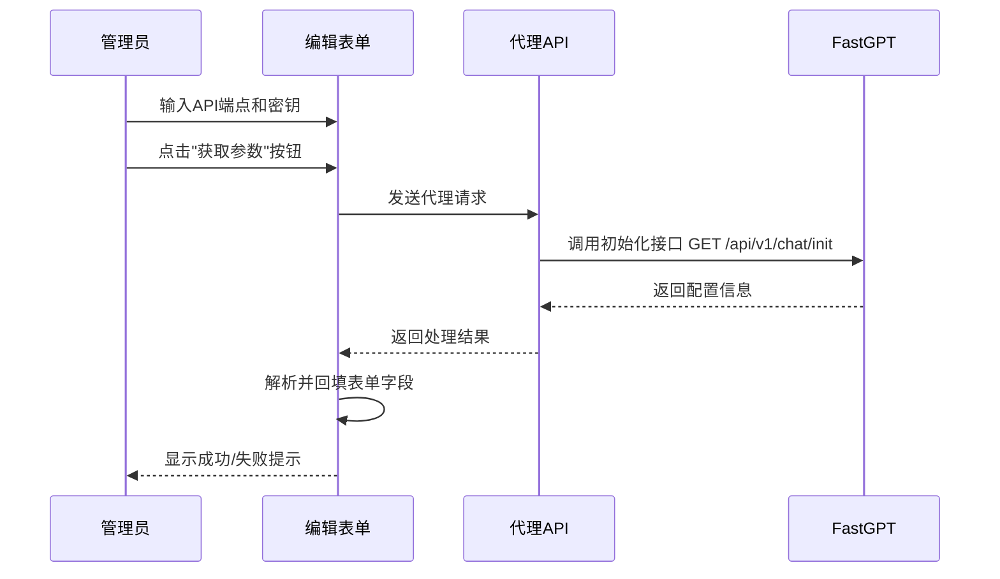

# FastGPT智能体参数获取与回填方案

## 1. 需求概述

在编辑智能体页面中，增加"获取参数"按钮，实现以下功能：

1. 输入API端点和API密钥后，点击按钮调用FastGPT初始化接口
2. 获取FastGPT应用配置信息并自动回填到表单中
3. 支持回填的字段包括：应用ID、智能体名称、描述信息、欢迎语、多模态模型等
4. 支持回填FastGPT全局变量配置

## 2. 技术方案

### 2.1 FastGPT初始化接口分析

根据`fastgpt-chat-api.md`文档，FastGPT初始化接口的关键信息如下：

**请求地址**：`GET https://fastgpt.run/api/v1/chat/init`

**请求头**：

```
Content-Type: application/json
Authorization: Bearer {API_KEY}
```

**响应格式**：

```json
{
  "code": 200,
  "data": {
    "chatId": "11",
    "appId": "67dd2f0dedb9d9c7419aa8d5",
    "app": {
      "chatConfig": {
        "welcomeText": "您好呀！我是您的AI智能体...",
        "variables": [
          {
            "id": "rrxjek",
            "key": "问题历史",
            "label": "问题历史",
            "type": "custom",
            "required": false,
            "maxLen": 50,
            "enums": [{ "value": "" }],
            "valueType": "any",
            "icon": "core/workflow/inputType/customVariable",
            "list": [{ "value": "" }],
            "description": "",
            "defaultValue": ""
          }
          // 其他变量...
        ]
      },
      "name": "熵犇犇定制需求分析",
      "avatar": "/api/system/img/681077bf119dd736232e0a4f.png",
      "intro": "熵犇犇定制需求智能应用...",
      "type": "advanced",
      "chatModels": ["qwq-plus-latest"]
    }
  }
}
```

### 2.2 接口调用流程



### 2.3 数据结构扩展

需要在Agent类型中添加全局变量相关字段：

```typescript
// 全局变量类型定义
interface GlobalVariable {
  id: string;
  key: string;
  label: string;
  type: string; // 'custom' | 'select' 等
  required: boolean;
  valueType: string;
  description?: string;
  defaultValue?: string;
  maxLen?: number;
  icon?: string;
  enums?: Array<{ value: string; label?: string }>;
  list?: Array<{ value: string; label?: string }>;
}

// 扩展Agent类型
interface Agent {
  // 现有字段...
  globalVariables?: GlobalVariable[];
}
```

### 2.4 UI组件设计

在高级设置选项卡中添加全局变量配置区域：

```jsx
<TabsContent value='advanced' className='space-y-4'>
  {/* 现有高级设置... */}

  <div className='space-y-2'>
    <Label className='text-pantone369-700 dark:text-pantone369-300'>
      全局变量
    </Label>
    <div className='border rounded-md p-4 space-y-2'>
      {globalVariables.length > 0 ? (
        <div className='space-y-2'>
          <div className='grid grid-cols-4 gap-2 font-medium text-sm'>
            <div>变量名</div>
            <div>类型</div>
            <div>是否必填</div>
            <div>描述</div>
          </div>
          {globalVariables.map((variable, index) => (
            <div
              key={variable.id || index}
              className='grid grid-cols-4 gap-2 items-center text-sm py-1 border-b'
            >
              <div>{variable.label || variable.key}</div>
              <div>{variable.type}</div>
              <div>{variable.required ? '必填' : '选填'}</div>
              <div>{variable.description || '-'}</div>
            </div>
          ))}
        </div>
      ) : (
        <div className='text-gray-500 text-center py-2'>暂无全局变量</div>
      )}
    </div>
  </div>
</TabsContent>
```

## 3. 开发计划

### 3.1 阶段一：基础功能实现（2天）

1. **接口代理实现**（0.5天）
   - 完善chat-proxy API，支持GET请求处理
   - 添加错误处理和超时机制

2. **获取参数按钮实现**（0.5天）
   - 在表单中添加按钮UI
   - 实现点击事件和加载状态

3. **基础字段回填功能**（1天）
   - 实现应用ID、名称、描述等基础字段回填
   - 添加成功/失败提示

### 3.2 阶段二：全局变量支持（3天）

1. **类型定义扩展**（0.5天）
   - 添加GlobalVariable接口定义
   - 更新Agent类型

2. **全局变量解析与存储**（1天）
   - 从FastGPT响应中解析全局变量信息
   - 实现全局变量状态管理

3. **全局变量UI组件**（1.5天）
   - 设计全局变量展示组件
   - 实现变量类型和必填项标识

### 3.3 阶段三：测试与优化（2天）

1. **单元测试**（0.5天）
   - 测试接口代理功能
   - 测试参数解析逻辑

2. **集成测试**（0.5天）
   - 测试完整获取参数流程
   - 测试各类型全局变量回填

3. **边界情况处理**（0.5天）
   - 处理网络错误情况
   - 处理响应格式异常情况

4. **性能优化**（0.5天）
   - 优化大量全局变量时的渲染性能
   - 减少不必要的重渲染

## 4. 实现细节

### 4.1 代理接口实现

```typescript
// pages/api/chat-proxy.ts
import { NextApiRequest, NextApiResponse } from 'next';
import axios from 'axios';

export default async function handler(
  req: NextApiRequest,
  res: NextApiResponse
) {
  if (req.method !== 'POST') {
    return res.status(405).json({ error: 'Method not allowed' });
  }

  try {
    const { targetUrl, method = 'POST', headers = {}, body } = req.body;

    // 验证目标URL
    if (!targetUrl || typeof targetUrl !== 'string') {
      return res.status(400).json({ error: 'Invalid target URL' });
    }

    // 发送请求到目标URL
    const response = await axios({
      method: method,
      url: targetUrl,
      headers: headers,
      data: method === 'GET' ? undefined : body,
      timeout: 30000, // 30秒超时
    });

    // 返回响应
    return res.status(response.status).json(response.data);
  } catch (error: any) {
    console.error('Proxy request failed:', error);

    // 返回错误信息
    return res.status(error.response?.status || 500).json({
      error: error.message,
      details: error.response?.data || 'Unknown error',
    });
  }
}
```

### 4.2 获取参数按钮和处理逻辑

```typescript
// 在AgentForm组件中添加
import { useState, useEffect } from "react"
import axios from "axios"

// 添加状态变量
const [globalVariables, setGlobalVariables] = useState<GlobalVariable[]>([])
const [isLoading, setIsLoading] = useState(false)

// 获取参数函数
const fetchAgentParams = async () => {
  // 验证必要字段
  if (!apiUrl || !apiKey) {
    toast({
      title: "请先填写API端点和API密钥",
      description: "这些字段是获取参数的必要条件",
      variant: "destructive",
    })
    return
  }

  setIsLoading(true)
  try {
    // 构建初始化请求URL
    const baseApiUrl = apiUrl.replace('/chat/completions', '')
    const initUrl = `${baseApiUrl}/chat/init`

    // 通过代理发送请求
    const response = await axios.post('/api/chat-proxy', {
      targetUrl: initUrl,
      method: 'GET',
      headers: {
        'Content-Type': 'application/json',
        'Authorization': `Bearer ${apiKey}`
      }
    })

    // 处理响应
    const data = response.data

    if (data.code === 200 && data.data) {
      // 回填基础字段
      setAppId(data.data.appId)
      setName(data.data.app.name || "")
      setDescription(data.data.app.intro || "")

      // 设置欢迎语
      if (data.data.app.chatConfig?.welcomeText) {
        setWelcomeText(data.data.app.chatConfig.welcomeText)
      }

      // 处理全局变量
      if (data.data.app.chatConfig?.variables && Array.isArray(data.data.app.chatConfig.variables)) {
        setGlobalVariables(data.data.app.chatConfig.variables)
      }

      // 如果有模型信息，设置多模态模型
      if (data.data.app.chatModels && data.data.app.chatModels.length > 0) {
        setMultimodalModel(data.data.app.chatModels[0])
      }

      toast({
        title: "获取参数成功",
        description: "已自动填充相关字段",
        variant: "default",
      })
    } else {
      throw new Error(data.code ? `错误码: ${data.code}` : "获取参数失败")
    }
  } catch (error) {
    console.error("获取参数失败:", error)
    toast({
      title: "获取参数失败",
      description: error instanceof Error ? error.message : "请检查API端点和密钥是否正确",
      variant: "destructive",
    })
  } finally {
    setIsLoading(false)
  }
}

// 在表单中添加按钮
<div className="grid gap-2">
  <Label htmlFor="apiKey" className="text-pantone369-700 dark:text-pantone369-300">
    API Key <span className="text-red-500">*</span>
  </Label>
  <div className="flex gap-2">
    <Input
      id="apiKey"
      value={apiKey}
      onChange={(e) => setApiKey(e.target.value)}
      placeholder="sk-xxxxxxxxxxxxxxxxxxxxxxxx"
      required
      className="flex-1"
    />
    <Button
      type="button"
      variant="outline"
      onClick={fetchAgentParams}
      disabled={isLoading}
      className="whitespace-nowrap"
    >
      {isLoading ? "获取中..." : "获取参数"}
    </Button>
  </div>
</div>
```

### 4.3 全局变量组件实现

```tsx
// 全局变量列表组件
function GlobalVariableList({ variables }) {
  if (!variables || variables.length === 0) {
    return <div className='text-gray-500 text-center py-2'>暂无全局变量</div>;
  }

  return (
    <div className='space-y-2'>
      <div className='grid grid-cols-4 gap-2 font-medium text-sm text-gray-500 pb-1'>
        <div>变量名</div>
        <div>类型</div>
        <div>是否必填</div>
        <div>描述</div>
      </div>
      <div className='space-y-1'>
        {variables.map((variable, index) => (
          <div
            key={variable.id || index}
            className='grid grid-cols-4 gap-2 items-center text-sm py-1 border-b border-gray-100 dark:border-gray-800'
          >
            <div className='font-medium'>{variable.label || variable.key}</div>
            <div>{getVariableTypeLabel(variable.type)}</div>
            <div>{variable.required ? '必填' : '选填'}</div>
            <div className='truncate' title={variable.description}>
              {variable.description || '-'}
            </div>
          </div>
        ))}
      </div>
    </div>
  );
}

// 变量类型标签映射
function getVariableTypeLabel(type) {
  const typeMap = {
    text: '文本',
    select: '选择框',
    custom: '自定义',
    number: '数字',
    boolean: '布尔值',
  };
  return typeMap[type] || type;
}
```

### 4.4 保存逻辑修改

需要修改表单提交处理函数，确保全局变量也被保存：

```typescript
const handleSubmit = (e: React.FormEvent) => {
  e.preventDefault();

  // 验证表单...

  // 构建要保存的智能体对象
  const updatedAgent: Agent = {
    id: agent?.id,
    name,
    description,
    apiKey,
    appId,
    apiEndpoint: apiUrl,
    welcomeText,
    temperature,
    maxTokens,
    multimodalModel,
    canUploadFile,
    canUploadImage,
    isPublished,
    globalVariables, // 添加全局变量
    // 其他字段...
  };

  // 调用保存回调
  onSave(updatedAgent);
};
```

## 5. 开发规范

### 5.1 代码规范

1. **命名规范**
   - 变量/函数：使用camelCase（如`fetchAgentParams`）
   - 组件：使用PascalCase（如`GlobalVariableList`）
   - 常量：使用UPPER_SNAKE_CASE（如`DEFAULT_API_ENDPOINT`）

2. **注释规范**
   - 函数注释：描述功能、参数和返回值
   - 复杂逻辑：添加必要的内联注释
   - TODO注释：标记待完成的功能

3. **类型规范**
   - 所有变量和函数参数必须有明确的类型定义
   - 避免使用`any`类型，优先使用具体类型或泛型
   - 使用接口（interface）定义复杂数据结构

### 5.2 UI规范

1. **组件设计**
   - 遵循现有UI组件库的设计风格
   - 保持表单元素的一致性
   - 使用适当的间距和对齐方式

2. **交互反馈**
   - 所有操作提供明确的视觉反馈
   - 加载状态使用统一的指示器
   - 错误信息清晰明了，提供解决建议

3. **响应式设计**
   - 确保在不同屏幕尺寸下正常显示
   - 移动设备上优化表单布局

### 5.3 API调用规范

1. **错误处理**
   - 捕获并处理所有可能的异常
   - 提供用户友好的错误提示
   - 记录详细错误信息到日志

2. **安全性**
   - API密钥等敏感信息不直接存储在前端
   - 使用代理API进行接口调用
   - 验证所有用户输入

3. **性能优化**
   - 设置合理的请求超时时间
   - 避免频繁请求，添加节流或防抖机制
   - 缓存不经常变化的数据

## 6. 注意事项与风险

1. **API兼容性**
   - FastGPT API可能会有版本更新，需要保持关注
   - 不同版本的FastGPT返回的字段可能有差异

2. **性能考虑**
   - 全局变量数量可能较多，需要考虑渲染性能
   - 大型配置的加载可能需要优化

3. **安全性考虑**
   - API密钥是敏感信息，需要妥善处理
   - 避免在前端存储明文密钥

4. **用户体验**
   - 获取参数过程可能耗时，需要提供明确的加载状态
   - 处理网络异常情况，提供友好的错误提示

## 7. 后续优化方向

1. **批量操作支持**
   - 支持批量编辑全局变量
   - 支持导入/导出全局变量配置

2. **变量预览功能**
   - 提供变量在用户端的预览效果
   - 支持变量表单的实时验证

3. **历史版本管理**
   - 记录配置的历史版本
   - 支持回滚到之前的配置

4. **智能推荐**
   - 基于应用类型推荐合适的配置
   - 提供常用变量模板
